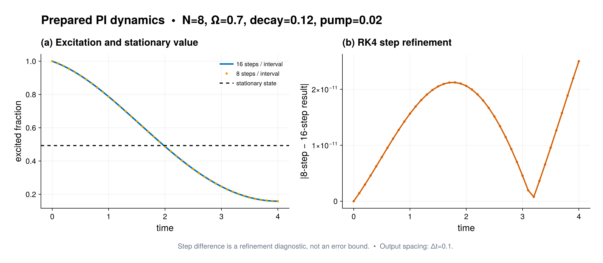

# Examples

Every Julia example has a companion guide describing the physical model, its
permutationally invariant (PI) representation, and the numerical method used.

Start with [`getting_started.jl`](getting_started.jl) and its
[line-by-line model-to-solution tutorial](../docs/src/getting_started.md).
It covers the basis, local operators, physical terms, initial state,
compilation, dynamics, stationary state, diagnostics, and a time-step check.

## Recommended workflow

New research scripts should prepare a model once and use the typed high-level
commands:

```julia
prepared = compile(model; backend=:auto)
states = solve_dynamics(prepared, rho0, (0.0, 10.0); saveat=0.1)
rho_ss = stationary_state(prepared)
slow_modes = liouvillian_spectrum(prepared; target=:largest_real, nev=6)

observable = CollectiveObservablePlan(model.basis, local_matrix)
values = [collective_expectation(rho, observable) for rho in states]
```

Use `diagnostics(prepared)` and `recommend_solver(model; task=...)` before a
large calculation. Prepare a `ReductionPlan(basis, k)` when the same marginal,
purity, or negativity is evaluated repeatedly. The examples that explicitly
compare sparse and matrix-free generators, matrix exponentials, or individual
Krylov algorithms intentionally use the lower-level API for those checks.

## Makie figures

The literature and trajectory examples use CairoMakie for publication-style
figures without making Makie a dependency of the core package. Every
standalone paper-specific example now has an optional numerical figure; the
generic backend and visualization demonstrations retain their dependency-free
output. Prepare the separate examples environment once from the repository
root:

```sh
julia --project=examples -e 'using Pkg; Pkg.develop(path="."); Pkg.instantiate()'
```

Then run a figure-producing example with, for example,

```sh
julia --project=examples examples/correlated_superradiance.jl
```

Figures display in Makie-capable front ends and are saved as both PDF and PNG
under the ignored `examples/figures/` directory. Set
`PI_EXAMPLE_FIGURE_DIR=/path/to/output` to choose another destination. The
same scripts still perform all numerical assertions when run from the root
environment without CairoMakie; only the figure-generation step is skipped.
The loader deliberately requires CairoMakie to be declared by the active
project and does not borrow a potentially incompatible global installation.
Set `PID_EXAMPLE_RENDER=0` to disable rendering explicitly even in the
examples environment. This is the mode used by executable-example CI.

Each paired guide embeds a curated expected-output snapshot from
`docs/src/assets/example_figures/`. Those reviewed PNG/SVG files are copied
from a successful default run; documentation builds never launch the
underlying solve. Re-run the example for changed parameters, and treat
trajectory bands, hierarchy cutoffs, time steps, finite-size grids, and solver
tolerances as convergence controls rather than properties certified by the
snapshot.



| Example | Guide | Topic |
|---|---|---|
| `getting_started.jl` | [Getting started](getting_started.md) | First PI model from local matrices through dynamics, stationary state, diagnostics, and convergence |
| `composite_ensembles.jl` | [Composite PI ensembles](composite_ensembles.md) | Two compressed ensembles, a finite ancilla, factorized dynamics, and fixed-capacity matrix-RHS actions |
| `composite_quantum_trajectories.jl` | [Composite stochastic systems](composite_quantum_trajectories.md) | Density-valued cross-factor jumps, reusable worker workspaces, online statistics, and deterministic master comparison |
| `global_pseudomode_cavity.jl` | [One shared damped cavity](global_pseudomode_cavity.md) | Factorized Tavis--Cummings dynamics, system/mode reductions, radiated flux, and a cutoff-boundary check |
| `cumulant_bridge.jl` | [Higher-order cumulant bridge](cumulant_bridge.md) | Exact PI local moments, neutral model metadata, and closure-error comparisons |
| `correlated_reservoirs.jl` | [Correlated Kossakowski reservoirs](correlated_reservoirs.md) | Cross-correlated local/collective one-body noise, observable-only dynamics, and preallocated matrix schedules |
| `all_to_all_xx_spin_local_pseudomodes.jl` | [All-to-all XX spins with local pseudomodes](all_to_all_xx_spin_local_pseudomodes.md) | Exact PI supersites, spin-only negativity, prepared-preconditioned GMRES, a strong-parity-reduced x-GHZ solve, fitted-boundary exports, and cutoff checks |
| `driven_qubits.jl` | [Driven qubits](driven_qubits.md) | Coherent drive, local decay, and the specialized one-body marginal kernel |
| `periodic_decay_channel.jl` | [Periodic decay channel](periodic_decay_channel.md) | Reusable matrix-free period action, selected multipliers, symmetry restriction, and a trace-fixed periodic state |
| `dissipative_discrete_time_crystal.jl` | [Dissipative discrete time crystal](dissipative_discrete_time_crystal.md) | Floquet period-doubling precursor |
| `independent_dephasing_coherence.jl` | [Independent-dephasing coherence](independent_dephasing_coherence.md) | Independent dephasing |
| `boundary_time_crystal.jl` | [Boundary time crystal](boundary_time_crystal.md) | Gap closing and oscillatory modes |
| `one_axis_twisting.jl` | [One-axis twisting](one_axis_twisting.md) | Collective nonlinear dynamics |
| `steady_superradiance.jl` | [Steady superradiance](steady_superradiance.md) | Pumped superradiant steady states |
| `meanfield_time_crystal.jl` | [Mean-field time-crystal prediction](meanfield_time_crystal.md) | Finite-`N` product closure, thermodynamic prediction, and exact PI comparison |
| `cooperative_fluorescence.jl` | [Cooperative fluorescence](cooperative_fluorescence.md) | Exact driven-dissipative steady state |
| `pt_symmetric_time_crystal.jl` | [PT-symmetric time crystal](pt_symmetric_time_crystal.md) | Exact balanced-gain/loss spectrum and matrix-free dynamics |
| `paper_models.jl` | [Paper model constructors](paper_models.md) | Reusable literature models |
| `pbody_pair_processes.jl` | [Pair processes](pbody_pair_processes.md) | Appendix-D p-body terms and exact-support packed path geometry |
| `parameter_scan.jl` | [Prepared parameter scans](parameter_scan.md) | Compiled scalar-rate families, recycled GMRES continuation, restart, streaming diagnostics, and batched sensitivities |
| `pi_heom.jl` | [PI--HEOM](pi_heom.md) | Exactly scaled hierarchy, analytic dephasing, depth comparisons, fixed-capacity matrix-RHS actions, SciML construction, and block-preconditioned GMRES |
| `pi_hops.jl` | [PI--HOPS collective dephasing](pi_hops.md) | Direct-sum Schur pure-state hierarchy, stationary colored-noise ensemble, analytic coherence, and deterministic PI--HEOM comparison |
| `nonmarkovian_dynamical_decoupling.jl` | [Non-Markovian dynamical decoupling](nonmarkovian_dynamical_decoupling.md) | Ideal CPMG and UDD4 pulses applied to every HOPS auxiliary and HEOM ADO, compared with full-line and positive-frequency Lorentzian filter curves |
| `pi_hops_collective_emission.jl` | [PI--HOPS collective emission](pi_hops_collective_emission.md) | Non-Hermitian shared-bath coupling, exact one-excitation hierarchy closure, prescribed-noise paths, and conditioned `hops_rhs!` |
| `pi_hops_mixed_multibath.jl` | [Mixed-state, multi-bath PI--HOPS](pi_hops_mixed_multibath.md) | Schur spectral initialization, reusable batch workspaces, Monte Carlo diagnostics, hierarchy metadata, and importance pruning |
| `interacting_boundary_time_crystal.jl` | [Interacting boundary time crystal](interacting_boundary_time_crystal.md) | Nonlinear collective-spin slow modes |
| `dissipative_collective_spin_pairing.jl` | [Dissipative collective-spin pairing](dissipative_collective_spin_pairing.md) | Exact finite PI versus finite-product and thermodynamic mean-field predictions |
| `correlated_superradiance.jl` | [Correlated superradiance](correlated_superradiance.md) | Two-atom analytic benchmark, `N=30` radiated pulse, and peak-state Schur blocks |
| `qubit_population_dynamics.jl` | [Certified qubit population dynamics](qubit_population_dynamics.md) | Six-rate model, reduced population evolution, and stationary populations |
| `qudit_coherent_state_q_distribution.jl` | [Generalized qudit coherent-state Q](qudit_coherent_state_q_distribution.md) | Qutrit Schur-sector coherent-state data and qubit normalization sanity check |
| `quantum_regression.jl` | [Quantum regression](quantum_regression.md) | Exact PI two-time correlations, antibunching, and optical spectra |
| `research_utilities.jl` | [Research utilities](research_utilities.md) | PI channels, POVMs, tomography, checkpoints, population metadata, and joint symmetries |
| `quantum_trajectories.jl` | [Analytic independent-emitter trajectory benchmark](quantum_trajectories.md) | Independent-emitter state, count, and no-jump laws |
| `irrep_block_visualization.jl` | [Irrep-block visualization](irrep_block_visualization.md) | Steady-state blocks, Young-diagram labels, compressed density spectrum, and superoperator couplings as SVG |
| `spectral_visualization.jl` | [Spectral visualization](spectral_visualization.md) | Liouvillian eigenvalues and Floquet multiplier/exponent SVGs |
| `local_pumping.jl` | [Local pumping](local_pumping.md) | Exact thermal product state |
| `spin_phase_space.jl` | [Sector-resolved spin phase space](spin_phase_space.md) | Multi-sector Husimi-Q and spin-Wigner data with dependency-free SVG rendering |
| `steady_state_methods.jl` | [Steady-state solvers](steady_state_methods.md) | Typed solver choices, shift-invert, matrix-free GMRES, and direct prepared-kernel Schur preconditioning |
| `streaming_output.jl` | [Streaming output](streaming_output.md) | Observable-only dynamics and state-free online trajectory statistics |
| `weak_pi_trajectories.jl` | [Weak-PI pseudo-ket trajectories](weak_pi_trajectories.md) | Schur-Kraus paths, event-driven confidence stopping, stationary batch diagnostics, and deterministic PI comparisons |
| `homodyne_pi_trajectories.jl` | [Homodyne PI trajectories](homodyne_pi_trajectories.md) | Conditional collective fluorescence and its unconditional ensemble limit |
| `superradiant_quantum_trajectories.jl` | [Superradiant quantum trajectories](superradiant_quantum_trajectories.md) | Collective/local radiated pulses: trajectory ensemble versus population master equation |

Run a numerical example from the package root with:

```sh
julia --project=. -e 'using Pkg; Pkg.instantiate()'  # first local run only
julia --project=. examples/<name>.jl
```

For a fast cross-cutting check of user-facing scripts, run the same two
isolated shards as CI:

```sh
julia --startup-file=no --project=. test/run_quick_examples.jl --shard 1/2
julia --startup-file=no --project=. test/run_quick_examples.jl --shard 2/2
```

List the curated scripts with
`julia --startup-file=no --project=. test/run_quick_examples.jl --list`.
The runner sets `PID_EXAMPLE_QUICK=1` as a stable CI marker and
`PID_EXAMPLE_RENDER=0`, uses a fresh Julia process for each script, and retains
every selected example's default numerical assertions.

Use `--project=examples` for the Makie-enabled literature scripts: the
literature examples in the table, including the correlated-superradiance and
dissipative-collective-spin-pairing validations,
`quantum_trajectories.jl`, `meanfield_time_crystal.jl`, `pi_heom.jl`,
`nonmarkovian_dynamical_decoupling.jl`, the three `pi_hops*.jl` scripts, and
`qudit_coherent_state_q_distribution.jl`. The local-pseudomode example is the permutation-invariant
uniform-all-pair specialization of the manuscript's nearest-neighbour model,
not a reproduction of its spatial chain. Each paired guide describes its
panels and output stem.
Running the same script with
`--project=.` keeps all numerical assertions and skips only the optional
Makie block.

Fixed-step, Arnoldi, Floquet, and trajectory results must be convergence-tested
in their step size, Krylov dimension, period discretization, or ensemble size.
Every script keeps its published finite-size or analytical check next to the
library call so that API changes cannot silently alter the physical result.
