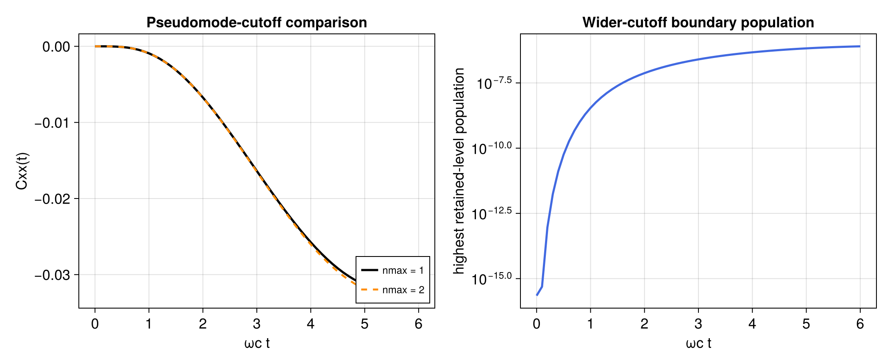
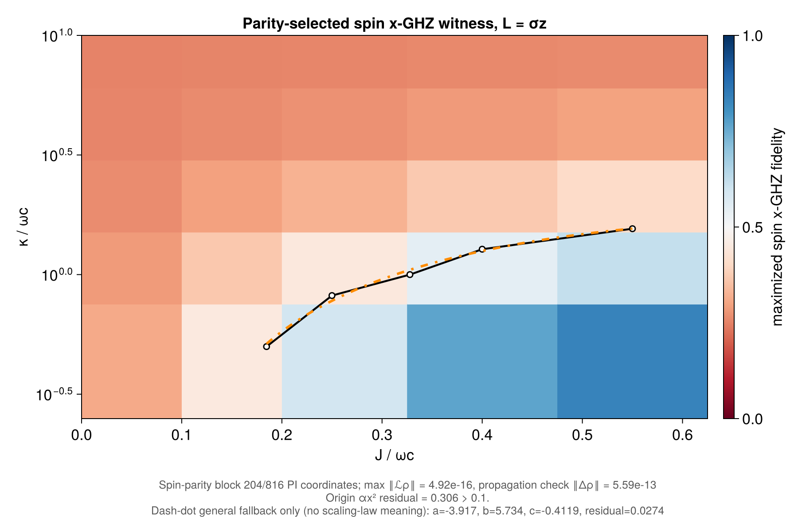

# All-to-all XX spins with local pseudomodes

Source:
[`all_to_all_xx_spin_local_pseudomodes.jl`](all_to_all_xx_spin_local_pseudomodes.jl)

## Scope of the example

This package-authored example treats `N` identical spin--pseudomode
supersites. Every unordered spin pair has the same XX interaction, and every
supersite has the same local Hamiltonian, spin--mode coupling, and mode-loss
channel. The object permuted by the symmetric group is the complete local
supersite

```math
\mathcal H_{\mathrm{site}}
=\mathcal H_{\mathrm{spin}}\otimes\mathcal H_{\mathrm{mode}}.
```

The model is consequently exactly PI at any fixed pseudomode cutoff. Every
distinct pair has the same correlator; there is no site-distance coordinate.

At fixed cutoff, the enlarged spin-plus-pseudomode state obeys a Markovian
Lindblad equation. Tracing out the local modes yields the intended
finite-memory, generally non-Markovian reduced spin dynamics. This is the
standard pseudomode strategy; see Garraway,
[*Phys. Rev. A* **55**, 2290 (1997)](https://doi.org/10.1103/PhysRevA.55.2290).

## Hamiltonian and damping convention

After truncating each pseudomode to occupations `0:nmax`, one supersite has
dimension

```math
d=2(n_{\max}+1).
```

The example evolves

```math
H=-J_{\mathrm{pair}}\sum_{i\lt j}X_iX_j
  +\omega_c\sum_i a_i^\dagger a_i
  +g\sum_i\left(L_i a_i^\dagger+L_i^\dagger a_i\right),
\qquad
g=\sqrt{\gamma\kappa},
```

with one local pseudomode-loss term at every site. Here `X` acts on the spin,
`a` acts on its truncated mode, and `L` is selected with
`coupling=:minus` or `coupling=:z`. In the latter case `L` is Hermitian and
the interaction reduces to a longitudinal coupling proportional to
`sigma_z*(a+a')`.

The package defines

```math
\mathcal D[A]\rho
=A\rho A^\dagger-
\frac{1}{2}\left\{A^\dagger A,\rho\right\}.
```

This helper adopts the Lorentzian-pseudomode parameterization
`LocalJump(a; rate=2kappa)` and `g=sqrt(gamma*kappa)`. Here `kappa` is half the
package Lindblad rate, so neither factor should be applied a second time in a
calling script. The convention is stated explicitly to keep parameter scans
reproducible.

`all_to_all_xx_spin_local_pseudomode_model` interprets `Jpair` literally:
it is the coefficient of each unordered pair and the constructor inserts no
system-size scaling. The executable uses the extensive Curie--Weiss choice

```math
J_{\mathrm{pair}}=\frac{J}{N-1}.
```

Thus the `J` shown on its axes is a collective interaction scale, not the
literal `PBodyHamiltonian` rate. To study an unscaled all-pair model, pass the
desired coefficient directly as `Jpair`.

The pair term is lowered with `PBodyHamiltonian`. The script independently
checks the identity

```math
\sum_{i\lt j}X_iX_j
=\frac{1}{2}\left[\left(\sum_iX_i\right)^2-NI\right].
```

The scalar identity drops out of the commutator, so this supplies a separate
collective-square validation of the compiled generator.

## Model-to-solution workflow

The reusable helpers in [`paper_models.jl`](paper_models.jl) keep the tensor
ordering, cutoff matrices, rate conversion, and coupling convention together:

```julia
using LinearAlgebra
using PermutationalInvariantDynamics

include("examples/paper_models.jl")
using .PaperModels

N = 3
nmax = 1
J = 0.25
omega_c = 1.0
gamma = 0.05
kappa = 2.0

operators = local_pseudomode_operators(nmax)
basis = PIBasis(N, operators.dsite)
model = all_to_all_xx_spin_local_pseudomode_model(
    basis, operators;
    Jpair=J / (N - 1), omega_c, gamma, kappa,
    coupling=:minus,
)

local_ket = zeros(ComplexF64, operators.dsite)
local_ket[1] = 1 # |g> tensor |0>
rho0 = iid_pure_state(basis, local_ket)

pair_geometry = PBodyGeometry(basis, 2)
pair_sum = pbody_collective_operator(
    basis, kron(operators.x_site, operators.x_site), 2;
    cache=pair_geometry,
)

times = collect(range(0.0, 10.0; length=101))
prepared = compile(model; backend=:matrixfree)
solution = solve_dynamics(
    prepared, rho0, (first(times), last(times));
    saveat=times,
    steps_per_interval=8,
    observables=(pair_sum=pair_sum,),
    save_states=false,
)
Cxx = real.(solution.observables[:pair_sum]) / binomial(N, 2)
```

This compact snippet illustrates the ordinary `compile`/`solve_dynamics`
workflow over a short interval. The executable uses a different integrator for
the long curves extending to `omega_c*t=100`. At
`kappa/omega_c=20`, simply halving an explicit RK4 step did not provide a
reliable refinement of the broad decay. Each plotted long curve therefore
uses a matrix-free Liouvillian, one reusable dimension-30
`KrylovExpvWorkspace`, and preallocated `krylov_expv!` exponential actions
between successive output times. It retains the current PI state and the two
observable series rather than a state history. With 201 output points, the
default run performs 6000 Liouvillian applications per curve.

The broad `kappa/omega_c=20` curve is repeated independently with Krylov
dimension 40 and tighter absolute and relative tolerances. The script checks
the pointwise `Cxx` difference and the accumulated exponential-action error;
the current default comparison is at approximately `8e-16`, well inside its
regression tolerance. This Krylov refinement, rather than an unstable
fixed-step comparison, is the convergence evidence for the long dynamics
panel.

The initial state is `|g,0>^N`, for which the distinct-pair correlation
vanishes. `pbody_collective_operator` returns the sum over all unordered
pairs, so division by `binomial(N,2)` gives the common physical correlator

```math
C_{xx}=\langle X_iX_j\rangle,\qquad i\ne j.
```

The complete PI basis is required: local mode loss and local spin--mode
exchange generally transfer weight between Schur sectors. Restricting the
basis to the fully symmetric sector would silently change the dynamics and is
not a valid optimization for this model.

For the small default stationary grid, the script compiles a sparse generator
and uses `DirectAlgorithm`. One reference point is solved independently with
a matrix-free `GMRESAlgorithm`, one explicit `KrylovWorkspace`, and one
`schur_sector_preconditioner`; the common-pair correlators are compared. For
the compiled PI source, the preconditioner lowers its diagonal sector blocks
directly from prepared physical kernels:

```julia
P = schur_sector_preconditioner(prepared, basis)
cost = preconditioner_cost(P)
@assert cost.block_construction === :prepared_kernels
@assert cost.setup_block_applications == 0
```

Only the operator-scale probes remain. Reuse the workspace and preconditioner,
and continuation-seed neighbouring parameter points, for a larger feasible PI
dimension. Set `expected_reuses` to the number of solves that will actually
share the object; the single reference solve in this example declares one.
Solver convergence does not replace the cutoff study described below.

## Density-valued and weak-PI trajectory stationary estimates

The same reference point is also solved without a stationary linear solve,
using two exact unravelings of the finite-cutoff Lindblad equation.
`trajectory_steady_state` evolves independent density-valued PI quantum-jump
paths beyond a burn-in time and returns their post-settling average:

```julia
trajectory_plan = TrajectoryPlan(prepared)
trajectory_count = 16
trajectory_workspace = TrajectoryBatchWorkspace(
    trajectory_plan, rho0;
    workers=min(trajectory_count, max(1, Threads.nthreads())),
)

trajectory_stationary = trajectory_steady_state(
    trajectory_plan, rho0;
    trajectories=trajectory_count,
    settling_time=100.0 / omega_c,
    samples_per_trajectory=11,
    sampling_interval=10.0 / omega_c,
    dt=0.02 / omega_c,
    max_jump_probability=0.02,
    algorithm=:fixed,
    seed=2026,
    threaded=Threads.nthreads() > 1,
    workspace=trajectory_workspace,
    return_info=true,
)
rho_trajectory_ss = trajectory_stationary.state
```

For the product initial state, every occupied multiplicity-weighted Schur
block has rank one. It can therefore also be converted to an auxiliary
direct-sum pseudo-ket and evolved with the sector-resolving weak-PI backend:

```julia
weak_initial = weak_pi_pseudoket(rho0)
weak_plan = WeakPITrajectoryPlan(prepared)
weak_trajectory_count = 2 * trajectory_count
weak_workspace = WeakPITrajectoryBatchWorkspace(
    weak_plan, weak_initial;
    workers=min(weak_trajectory_count, max(1, Threads.nthreads())),
)

weak_stationary = weak_pi_trajectory_steady_state(
    weak_plan, weak_initial;
    trajectories=weak_trajectory_count,
    settling_time=100.0 / omega_c,
    samples_per_trajectory=11,
    sampling_interval=10.0 / omega_c,
    dt=0.02 / omega_c,
    max_jump_probability=0.02,
    seed=22026,
    threaded=Threads.nthreads() > 1,
    workspace=weak_workspace,
    return_info=true,
)
rho_weak_ss = weak_stationary.state
```

Both trajectory plans reuse the already compiled matrix-free model; their
batch workspaces are then reused across every path.

The default `N=3` supersite calculation has 816 PI density coordinates but
only 44 weak-PI pseudo-ket amplitudes. For `N=4` these dimensions are 3876 and
116, respectively; the executable obtains both values from the basis and
does not assume the default size. A weak path is not a labeled-particle wave
function: it is an auxiliary pure state in the direct sum of Schur irreps.
Local mode-loss events are resolved into one-box Kraus branches that may
change sector. During stationary estimation, each saved pseudo-ket outer
product is accumulated directly into physical PI density coordinates, so no
pseudo-ket or density-state history is retained. The initial density operator
must be representable by one pseudo-ket; `weak_pi_pseudoket` deliberately
rejects a general mixed input instead of choosing a decomposition silently.

Thus each path is sampled at `omega_c*t = 100, 110, ..., 200`. Samples from
one path are time-correlated. The routine first averages that complete window
within each path, then treats only the independent path means as Monte Carlo
samples. The returned `sample_spread` is the square root of their unbiased
Hilbert--Schmidt sample variance and `standard_error` is the corresponding
norm standard error of the density-operator estimate. These quantities are
cheap in the orthonormal PI coefficient basis and require neither full-Hilbert
reconstruction nor stored trajectory histories. The example reuses one batch
workspace per backend, one independent workspace and random stream per
worker, and fixed seeds. The cheap weak-PI backend uses 32 paths versus 16
density-valued paths in the default run, reducing the noise of the plotted
weak-PI marker while adding little runtime. The denser
`PI_PSEUDOMODE_FULL_SCAN=1` mode uses 128 and 64 paths, respectively.

At the reference point the script compares both averages directly with the
sparse stationary state and with each other. It evaluates `Cxx`, the
highest-level population, and the spin-only negativity from each **averaged
density operator**. In particular, it does not average the nonlinear
negativity of individual paths. It also checks state diagnostics, the
Liouvillian residual, trace error, and whether each direct-state discrepancy
is compatible with its reported Hilbert--Schmidt sampling error. The
black-outlined stars in the two stationary heat maps mark the weak-PI estimate
and use the same color scales as the surrounding direct-solver maps.

Both averages reproduce the same linear master equation, but their
conditional records are different: the density backend leaves the local gain
unresolved and generally produces a mixed conditional PI state, whereas the
weak backend samples a particular sector-resolving Kraus decomposition.
Individual paths and Monte Carlo variances therefore need not agree, and the
two fixed seeds should not be interpreted as paired random records.

This is a controlled estimator, not a stationary-state convergence
certificate. A research calculation must separately refine the burn-in time,
sampling-window length and spacing, number of independent paths, the selected
fixed-step or event-driven integration controls, and pseudomode cutoff. The
burn-in suppresses initial transients, while the longer window reduces
time-sampling noise; neither creates more
independent paths. Increasing the path count is what systematically reduces
the reported Monte Carlo standard error. `max_jump_probability` makes the
integrator shorten a step whenever needed to cap the conservative
`lambda*dt` jump-probability bound, but it does not replace a step-refinement
study. The weak-PI estimator also supports `algorithm=:event`, whose adaptive
tolerances and event-root tolerance require their own refinement. Finally, if
a model has several strong-symmetry stationary components, the initial state
selects the component sampled by the trajectories. The returned residual can reveal an
insufficient window, but a small residual alone does not prove uniqueness or
remove that initial-state dependence.

## Spin-only negativity

The physical question is the entanglement of two spins after their two local
pseudomodes have been traced out. Applying the package's supersite
`negativity` directly would answer a different question because each side
would still contain a truncated mode.

The repeated map now prepares the exact local-factor trace once:

```julia
trace_plan = LocalFactorTracePlan(
    basis, (2, operators.levels); traced_factor=2)
trace_work = LocalFactorTraceWorkspace(trace_plan)
rho_spin = PIState(trace_plan.output_basis)

local_factor_trace!(
    rho_spin, rho_supersite, trace_plan, trace_work)
```

`local_factor_trace!` keeps all `N` particles but changes the local dimension
from `2*operators.levels` to `2`. Its plan constructs normalized symmetric
occupations of local matrix units directly in Schur coordinates and never
forms a `d^N` state. Each later state uses two dense matrix-vector products
and one output-sized workspace vector.

For the plotted two-spin quantity, a prepared particle reduction then keeps
two spins and applies the ordinary qubit negativity plan:

```julia
pair_plan = ReductionPlan(trace_plan.output_basis, 2)
pair_work = ReductionWorkspace(pair_plan; mode=:reduction)
rho_pair = PIState(pair_plan.output_basis)
reduced_state!(rho_pair, rho_spin, pair_plan, pair_work)

cut = ReductionPlan(pair_plan.output_basis, 1)
cut_work = ReductionWorkspace(cut; mode=:negativity)
N_pair = negativity(rho_pair, 1; plan=cut, workspace=cut_work)
```

As an independent small-system oracle at one reference point, the example
still evaluates all 16 distinct-particle Pauli moments with operators
`sigma_mu tensor I_mode` and reconstructs

```math
\rho_{\mathrm{spin}}^{(2)}
=\frac{1}{4}\sum_{\mu,\nu=0}^{3}
\left\langle\sigma_\mu^{(1)}\sigma_\nu^{(2)}\right\rangle
\sigma_\mu\otimes\sigma_\nu.
```

The oracle checks Hermiticity, unit trace, and positivity before partially
transposing the second physical qubit, and it agrees with the prepared
local-factor route. The plotted value is

```math
\mathcal N
=\frac{\left\|\left(\rho_{\mathrm{spin}}^{(2)}\right)^{T_2}\right\|_1-1}{2}.
```

This distinction is essential when comparing spin entanglement with an
explicit-environment embedding.

## Longitudinal coupling and the spin GHZ witness

The longitudinal choice, `coupling=:z`, retains the strong
global spin-parity symmetry

```math
\Pi_z=\prod_{i=1}^{N}\sigma_z^{(i)}.
```

An unrestricted trace-fixed stationary solver would therefore be asked to
choose among symmetry-resolved stationary components. The example avoids that
ambiguity. It starts from `|e,0>^N`, which has `Pi_z=+1` in the package spin
convention, and uses `diagonal_symmetry_restriction` to restrict both the ket
and bra indices to that Hilbert-parity support before solving the stationary
equation. For the default
`N=3, nmax=1` calculation this reduces the stationary matrix from 816 PI
coordinates to 204.

This is finer than projecting the density operator onto the trivial weak
conjugation charge

```math
\Pi_z\rho\Pi_z=\rho.
```

That condition retains both the `(+,+)` and `(-,-)` Hilbert-parity blocks,
has dimension 408 here, and therefore leaves the trace-fixed stationary
problem nonunique. Because `sigma_z tensor I_mode` is diagonal, the package
finds the charge of each GT pattern directly from its local-label content. It
then gathers only coefficient entries whose row and column have the selected
charge. No `d^N` parity matrix or dense change of basis is constructed.

Every reduced solve constructs a `RestrictedLiouvillian`, whose sparse-column
scan certifies the full generator leakage before retaining the compressed
submatrix. If `L` maps any selected coordinate outside the requested block
beyond the stated tolerance, construction raises instead of silently
projecting the leakage away. The reduced solution is scattered back with
`embed!` into the ordinary PI state type, after which physical trace,
positivity, parity expectation, and the full Liouvillian residual are checked
normally.

There is an additional PI-compatible weak unitary symmetry for longitudinal
coupling. With mode parity $B=(-1)^{a^\dagger a}$, its local representative is

```math
R_{\mathrm{site}}=\sigma_x\otimes B,
\qquad R=R_{\mathrm{site}}^{\otimes N}.
```

It leaves the Hamiltonian invariant and sends every mode jump to its negative,
which leaves each dissipator unchanged. The script explicitly certifies this
weak covariance at a reference point. It does **not** project the requested
state onto one `R` charge: for odd `N`, `R` exchanges the two strong
spin-parity blocks. An `R`-even restriction would produce a parity-symmetrized
stationary combination and would generally erase the GHZ coherence being
measured. The individual site transformations have the same covariance in a
labeled model, but they single out sites and are not closed operators in the
PI coefficient space.

The plotted quantity is the largest fidelity obtained by optimizing only the
relative phase of the spin x-GHZ family

```math
|\mathrm{GHZ}_x(\phi)\rangle
=\frac{|{+x}\rangle^{\otimes N}
       +e^{i\phi}|{-x}\rangle^{\otimes N}}{\sqrt{2}}.
```

After tracing every pseudomode, define

```math
P_\pm=\langle {\pm x}|^{\otimes N}
\rho_{\mathrm{spin}}
|{\pm x}\rangle^{\otimes N},
\qquad
C=\langle {+x}|^{\otimes N}
\rho_{\mathrm{spin}}
|{-x}\rangle^{\otimes N}.
```

The phase-optimized fidelity is then

```math
F_{\mathrm{GHZ}_x}^{\max}
=\frac{P_++P_-}{2}+|C|.
```

`spin_x_ghz_fidelity` evaluates these three quantities as exact ordered
`N`-particle local moments. Every local projector or coherence is tensored
with the mode identity, so the pseudomodes are traced without constructing a
full spin density matrix. This is an `N`-body observable and becomes more
expensive than the pair diagnostics as `N` grows.

For every point in the displayed grid, the script checks state diagnostics,
strong-block invariance, parity expectation, and the full stationary residual
`norm(L*rho)`. At one independent reference point it retains the former
adaptive matrix-free `krylov_expv` calculation to `omega_c*t=1600`, compares
both the full PI state and GHZ fidelity with the reduced stationary solve, and
also compares a half-time witness. Thus the long propagation is a one-point
cross-check rather than the algorithm repeated across the grid. These checks
establish solver and symmetry consistency for the finite calculation; they do
not establish cutoff or thermodynamic convergence.
The contour `F_GHZx=0.5`, when crossed by the plotted range, is the standard
GHZ-fidelity witness threshold for genuine multipartite spin entanglement.

## Finite-grid contour guides and fallbacks

The script summarizes the shapes of two displayed level contours with the
origin-constrained law

```math
\frac{\kappa}{\omega_c}
\simeq \alpha\left(\frac{J}{\omega_c}\right)^2.
```

One fit uses the `coupling=:minus` sign-change contour `Cxx=0`; the other uses
the parity-selected `coupling=:z` witness contour
`F_GHZx^max=0.5`. The fixed-exponent $x^2$ law is tested first for both
contours. They are nevertheless separate models, and their fitted coefficients
should not be interpreted as two estimates of one common boundary. The
executable prints both values of `alpha` rather than hard-coding them in this
guide.

`quadratic_level_contour_fit` works in the physical dimensionless coordinates
`J/omega_c` and `kappa/omega_c`, even though the vertical plotting axis is
logarithmic. It finds threshold crossings on every horizontal and vertical
grid line, linearly interpolates each crossing in those physical coordinates,
removes duplicate grid-vertex crossings, and rejects a row or column with
multiple crossings rather than silently choosing a branch. For crossing
points $(x_i,y_i)$, the unweighted origin-constrained ordinary least-squares
coefficient is

```math
\alpha=\frac{\sum_i x_i^2y_i}{\sum_i x_i^4},
\qquad
x_i=\frac{J_i}{\omega_c},\quad
y_i=\frac{\kappa_i}{\omega_c}.
```

The fitted curve is drawn only within both the smallest-to-largest extracted
crossing span and the sampled vertical plotting domain; it is not extrapolated
beyond the scan. The returned diagnostics include the crossing points,
residual vector, RMS
residual, relative two-norm and maximum relative residual, pointwise
$y_i/x_i^2$ values, and the range obtained by leaving out one crossing at a
time. `boundary_sides` and `touches_boundary` report whether an extracted
contour reaches the edge of the scanned rectangle. A boundary touch warns
that the visible branch may be truncated by the chosen parameter window. The
leave-one-out range measures finite-grid sensitivity only; it is not a
statistical confidence interval.

The origin constraint is tested first. The example sets the explicit heuristic

```julia
CONTOUR_FIT_FALLBACK_RELATIVE_L2_THRESHOLD = 0.10
```

and triggers a second fit only when the constrained relative two-norm residual
strictly exceeds that value. The fallback model depends on the observable.

For the `Cxx=0` contour, the default fallback remains the general quadratic

```math
y=ax^2+bx+c,\qquad
x=\frac{J}{\omega_c},\quad y=\frac{\kappa}{\omega_c}.
```

It is solved in centered and scaled `x` coordinates with column-pivoted QR,
then converted back to the reported physical coefficients `(a,b,c)`. At least
four crossing points and numerical rank three are required, leaving at least
one residual degree of freedom.

For the `F_GHZx^max=0.5` contour, the script instead passes
`fallback_model=:power_law` and requests the positive power-law fallback

```math
y=\alpha_p x^\beta,\qquad \alpha_p\gt 0,\quad \beta\gt 0.
```

This is a two-parameter fit; it does not keep the exponent fixed at two. For a
trial exponent, the amplitude is eliminated analytically,

```math
\alpha_p(\beta)
=\frac{\sum_i x_i^\beta y_i}{\sum_i x_i^{2\beta}},
```

and the resulting one-dimensional problem is minimized in the original
physical $y=\kappa/\omega_c$ coordinate. Internally, scaled exponentials
avoid unnecessary overflow or underflow. A log--log regression supplies only
an initial exponent; logarithmic residuals are not the fit objective. At least
three positive crossing points and numerical rank two are required, leaving at
least one residual degree of freedom.

The result always retains the first $\beta=2$ fit and its diagnostics.
Depending on the requested fallback, `general_quadratic` or `power_law`
contains the second candidate's coefficients, residuals, rank diagnostics, and
curve. `display_model` is `:origin_constrained`, `:general_quadratic`,
`:power_law`, or `:raw_contour_only`. A fallback is selected only when its
relative two-norm residual in physical $y$ improves on the first fit and its
curve remains positive and inside the sampled vertical domain. Thus the two
residuals printed by the example use the same metric. The raw contour alone is
shown if a triggered fallback is underdetermined, rank deficient, fails its
one-dimensional optimization, does not improve the residual, or cannot be
plotted honestly on the sampled logarithmic axis. No fitted value is clipped,
made positive, or silently repaired. Set
`fallback_relative_l2_threshold=nothing` to disable fallback fitting.

The `0.10` threshold is a presentation heuristic, not a hypothesis test. A
three-parameter quadratic necessarily has more freedom and usually lowers its
in-sample residual; this does not make it a better scaling law. In particular,
nonzero `b` and `c` are empirical shape parameters with no inferred critical
meaning. Likewise, the fitted GHZ exponent `beta` is an empirical description
of this finite-grid witness contour, not a critical exponent or evidence for a
universal power law. When a fallback is selected, the figure and terminal
output report both the failed origin-constrained residual and the fallback
residual.

These fits are descriptive finite-grid guides. The compact run has only a
$5\times5$ parameter grid, while `PI_PSEUDOMODE_FULL_SCAN=1` uses
$9\times9$. Interpolated crossings from one grid are not independent data,
and a small least-squares residual does not establish a scaling law. Refine
both parameter axes, the pseudomode cutoff, and the stationary/long-time
solves before interpreting the contour shape. In particular, `Cxx=0` is only
a sign change of the common all-pair correlator, not a thermodynamic phase
boundary. `F_GHZx^max=0.5` is a sufficient GHZ-fidelity witness threshold,
not the boundary of the separable-state set.

### Saved boundary data

Every run saves the extracted boundaries and fitted candidate curves as two
UTF-8, tab-delimited text files. This happens independently of Makie, so the
files are also produced when the example is run under the root package
environment:

- `..._cxx_boundary.txt` contains the `Cxx=0` boundary for
  `coupling=:minus`;
- `..._ghz_witness_boundary.txt` contains the
  `F_GHZx^max=0.5` entanglement-witness boundary for `coupling=:z`.

The complete filenames include `N`, `nmax`, and either `compact` or `full`,
so calculations with different built-in grids do not overwrite one another.
Comment lines record the model, scan, threshold, interpolation, selected
display model, coefficients, residual diagnostics, and boundary-touch
metadata. The tabular columns are

```text
series    point_index    J_over_omega_c    kappa_over_omega_c
```

The `extracted_boundary` series is the set of interpolated contour points
used as fit input. `origin_quadratic_fit` is always retained, and an available
`general_quadratic_fit` or `power_law_fit` candidate is written as an
additional series. Thus the files preserve the raw finite-grid boundary even
when the fallback logic selects a different displayed curve or selects
`:raw_contour_only`.

By default these files are placed beside the generated figures in the ignored
`examples/figures` directory. Set `PI_EXAMPLE_FIGURE_DIR` to redirect both the
text data and Makie output:

```sh
PI_EXAMPLE_FIGURE_DIR=/path/to/results \
  julia --project=examples examples/all_to_all_xx_spin_local_pseudomodes.jl
```

## Cutoff and scaling

A complete `N`-supersite PI operator has

```math
n_{\mathrm{PI}}
=\binom{N+d^2-1}{N},
\qquad d=2(n_{\max}+1),
```

coordinates. The default `N=3` calculation therefore has 816 coordinates at
`nmax=1`, but 8436 at `nmax=2`. The method avoids an explicit `d^N` Hilbert
state while still growing rapidly with the local mode cutoff. Estimate this
dimension before launching a scan; increasing `N` and `nmax` simultaneously
can become impractical even in PI coordinates.

The example repeats one dynamical curve at `nmax=1` and 2. It
checks both the change in `Cxx(t)` and the population of the highest retained
mode level in the wider calculation. A small boundary population is useful
evidence but is not by itself a proof of convergence. Production results
should be repeated at successively larger cutoffs for every observable and
time interval being claimed. The built-in `nmax=1,2` comparison applies to the
`coupling=:minus` correlation curve. It does not certify the cutoff of the
separate `coupling=:z` GHZ map; repeat that map or selected points at a wider
cutoff before using it as a research result. This short cutoff comparison
still uses `solve_dynamics` with fixed-step RK4 and is separately bounded by
its short time interval and step choice; it should not be confused with the
Krylov convergence check for the long curves.

## Figures and interpretation

The main Makie figure presents the complementary dynamical and stationary
diagnostics:

- the first panel shows `Cxx(t)` for `kappa/omega_c = 1, 5, 20`, using the
  single distinct-pair PI correlator in place of a distance-resolved one and
  reusable matrix-free Krylov exponential actions for the long sweep;
- the second panel maps the stationary `Cxx` over `J/omega_c` and
  `kappa/omega_c`, with a black-outlined star marking and coloring the
  weak-PI trajectory estimate at the reference point. Its threshold overlay
  shows the raw finite-grid `Cxx=0` contour in black, its interpolated
  crossings as white circles, and the selected guide. A satisfactory
  origin-constrained fit is dashed gold; a triggered general-quadratic fallback
  is dash-dot dark orange;
- the third panel maps the spin-only two-spin negativity over the same grid.
  Its star is computed from the averaged weak-PI trajectory density operator
  and uses the heat-map color scale.

The annotation states the Kac scaling and that every pair shares one
correlator. The finite `N=3` heat maps are solver and model
demonstrations, not evidence for a thermodynamic phase boundary. PDF and PNG
copies are saved as
`all_to_all_xx_spin_local_pseudomodes.*`.

The two fitted-boundary text files described above are saved to the same
output directory before Makie is loaded.

A second figure overlays the `nmax=1` and 2 correlation curves and shows the
wider-cutoff highest-level population. It is saved as
`all_to_all_xx_spin_local_pseudomodes_cutoff.*`.

A third figure shows the parity-selected
`coupling=:z` spin x-GHZ fidelity. Its raw `0.5` contour marks the usual GHZ
witness threshold and is accompanied by its origin-constrained finite-grid
quadratic test or, when the `0.10` residual threshold is exceeded, the empirical
positive power-law fallback. It uses the same black/white convention and the
guide style described above. The annotation reports the 204-of-816
strong-parity coordinate reduction, the largest stationary Liouvillian
residual, the independent long-time-propagation discrepancy, both relevant fit
residuals, and the fitted power-law amplitude and exponent when selected. It is saved as
`all_to_all_xx_spin_local_pseudomodes_ghz.*`. As with the first heat maps,
this is a finite-size uniform-all-pair calculation.

The executable defaults to a compact stationary grid. Set
`PI_PSEUDOMODE_FULL_SCAN=1` for the denser built-in grid:

```sh
PI_PSEUDOMODE_FULL_SCAN=1 \
  julia --project=examples examples/all_to_all_xx_spin_local_pseudomodes.jl
```

The default system size is `N=3`. Select a larger size without editing the
script through `PI_PSEUDOMODE_N`; for example:

```sh
PI_PSEUDOMODE_N=4 \
  julia --project=examples examples/all_to_all_xx_spin_local_pseudomodes.jl
```

The stationary grid uses sparse direct factorizations, so its memory and run
time grow substantially between `N=3` and `N=4` even though both calculations
remain in PI coordinates.

Run the checked compact version, including its Makie output, with:

```sh
julia --project=examples examples/all_to_all_xx_spin_local_pseudomodes.jl
```

The numerical assertions also run under the root project; without the
examples-only CairoMakie dependency, only figure generation is skipped.

## Expected output






These snapshots use the checked compact `N=3` controls. The coarse maps are
illustrative; refine the parameter grid, pseudomode cutoff, stationary
residual, and trajectory sampling before using a boundary quantitatively.
