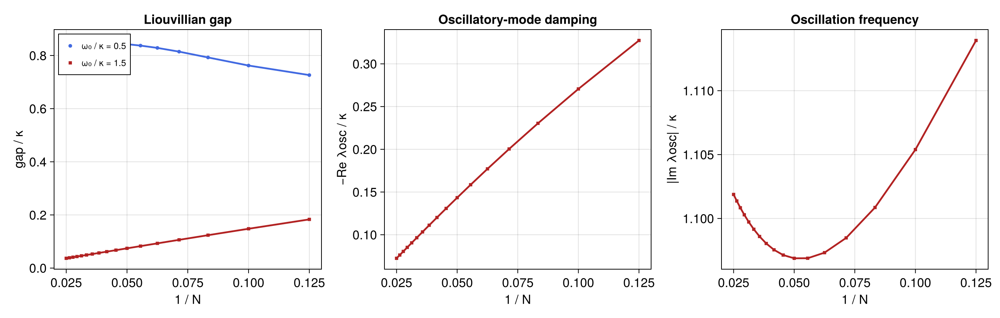

# Boundary time-crystal Liouvillian modes

Source: [`boundary_time_crystal.jl`](boundary_time_crystal.jl)

## Model

The collective-spin model of Iemini *et al.* has

```math
H=\omega_0 J_x,\qquad
\dot\rho=-i[H,\rho]+\frac{2\kappa}{N}\mathcal D[J_-]\rho .
```

Only the fully symmetric Schur sector is required because both the Hamiltonian
and jump operator are collective. The script studies `ω0/κ = 0.5` and `1.5`
on the 17-point grid `N = 8, 10, ..., 40`. This denser and substantially
larger-size sequence makes the curvature of the finite-size trends visible;
it remains a finite-size comparison rather than a thermodynamic extrapolation.

## Solution

Build the collective Hamiltonian and jump and restrict the PI basis to the
symmetric sector. Sizes through `N = 16` use `backend=:sparse` and a complete
dense reduced spectrum as a checked oracle. Larger sizes switch to
`backend=:matrixfree`. Jacobi--Davidson targeted at zero supplies the steady
and gap modes. In the time-crystalline regime, two one-mode solves targeted at
the positive and negative thermodynamic frequency scale
`sqrt(omega0^2-kappa^2)` supply the leading complex-conjugate pair. This narrow
targeted calculation avoids both a dense `(N+1)^2`-square Liouvillian and a
costly broad largest-real Krylov search.

The eigenvalue at zero is the steady mode, the largest nonzero real part
determines the gap, and the imaginary part of the slow mode diagnoses
persistent oscillations. Every selected calculation is required to converge,
the script checks a maximum reported Ritz residual of `2e-5`, and the
oscillatory eigenvalue must have a resolved complex-conjugate partner within
`1e-5`. These checks prevent a smooth-looking curve from hiding an
underconverged Krylov solve.

The library's `pi_liouvillian_gap` routine can be used when only the gap is
needed and can exploit identified weak-symmetry blocks. Here the selected
spectral window is intentional because the literature comparison also tracks
the oscillatory branch.

## Makie figure

The optional CairoMakie figure presents the finite-size scaling against
`1/N` in three aligned panels: the Liouvillian gap, the decay rate of the slow
oscillatory mode, and its oscillation frequency. The stationary and
time-crystalline parameter ratios use consistent colours and markers in the
gap panel. The damping and frequency panels show the resolved oscillatory
branch only for `ω0/κ = 1.5`; below threshold the leading selected modes are
real, so the script does not promote a faster, remote mode into an artificial
"slow oscillatory" curve. The normal figure contains 17 points per curve and
uses compact markers suited to that resolution. PDF and PNG copies are saved
as `boundary_time_crystal.*`.

## Run

```sh
julia --project=examples examples/boundary_time_crystal.jl
```

For a quick three-size numerical smoke check without rendering, use

```sh
PID_EXAMPLE_QUICK=1 PID_EXAMPLE_RENDER=0 \
  julia --project=. examples/boundary_time_crystal.jl
```

The ordered finite-size results show gap closing in the oscillatory regime;
repeat with increasing `N` before drawing a thermodynamic conclusion.

## Expected output



The displayed 17-size sequence is the research default. A thermodynamic
conclusion still requires an independently converged finite-size scaling
study beyond the plotted range.
