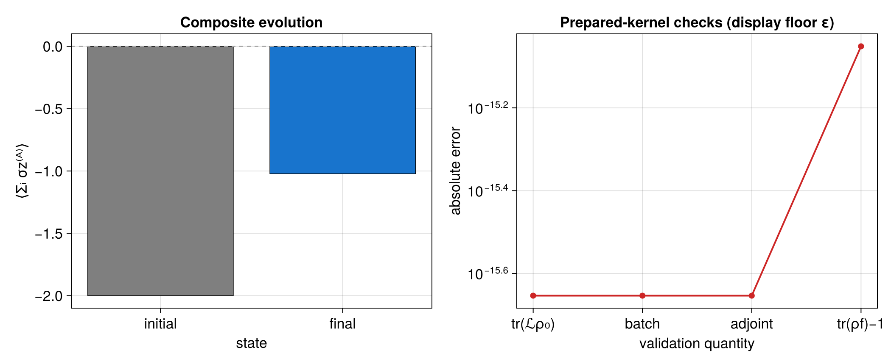

# Two PI ensembles coupled through a finite ancilla

This example demonstrates the composite operator-space backend with three
factors:

1. a permutationally invariant qubit ensemble A;
2. an independent permutationally invariant qubit ensemble B;
3. a finite two-level ancilla.

The runnable source is
[`composite_ensembles.jl`](composite_ensembles.jl).

## Model

Each ensemble has its own local spontaneous-emission generator. In addition,
ensemble A is coherently coupled to the ancilla through

```math
H_{A c}=g J_x^{(A)}\otimes\sigma_x^{(c)},
```

and ensemble B shares the correlated jump

```math
L_{B c}=J_-^{(B)}\otimes\sigma_-^{(c)}.
```

The complete generator is

```math
\mathcal L=\mathcal L_A+\mathcal L_B
-i[H_{Ac},\,\cdot\,]+\gamma_c\mathcal D[L_{Bc}].
```

The script uses two qubits in ensemble A and one in ensemble B, so ensemble A
already retains both of its Schur sectors, ``j=1`` and ``j=0``. The resulting
PI operator dimensions are 10 and 4 rather than full-space dimensions 16 and
4, and the finite ancilla contributes another factor of 4. Thus the complete
composite operator vector has only 160 coordinates. Increasing either
`PIBasis` continues to use its multi-sector compressed PI representation; it
does not create the ensemble's `2^N` Hilbert space.

## Coordinate convention

The first declared composite factor is the fastest flattened index. For
factor coordinates `rho_a.data`, `rho_b.data`, and `vec(rho_aux)`, the state
vector is

```julia
kron(vec(rho_aux), kron(rho_b.data, rho_a.data))
```

The example checks this equality explicitly. A product of factor maps follows
the same ordering, but `CompositeSuperoperator` applies it one tensor mode at
a time and never constructs the Kronecker matrix.

## Workflow

The two local `PIModel`s are compiled independently and lifted with
`local_superoperator_term`. `composite_hamiltonian_superoperator` lowers the
cross Hamiltonian to two products of factor left/right maps, while
`composite_dissipator_superoperator` lowers the correlated channel to gain and
anticommutator products.

The script then:

- combines the read-only term plans with `+`;
- applies the generator using an explicit
  `CompositeSuperoperatorWorkspace`;
- checks fixed-capacity matrix-RHS forward and adjoint applications against
  scalar-column calls;
- verifies that the derivative has zero physical trace;
- evolves with a preallocated `EvolutionWorkspace`;
- verifies final trace preservation;
- evaluates a factorized collective observable.

For block Krylov and sensitivity calculations, the script prepares

```julia
X = hcat(rho0.data, derivative)
Y = similar(X)
batch_work = CompositeSuperoperatorBatchWorkspace(
    generator; capacity=size(X, 2))
apply!(Y, generator, X, 0.0, nothing, batch_work)
```

The capacity is immutable: a wider matrix raises instead of growing hidden
buffers. Equal tensor fibres from all columns pass together through each
factor map, and `apply_adjoint!` reuses the same layout. Neither path forms a
global Kronecker matrix.

## Expected output



The left panel compares the initial and final expectation of
``\sum_i\sigma_z^{(i)}`` in ensemble A after the preallocated evolution. These
are endpoint values, not a sampled trajectory. The right panel reports trace
preservation, batched forward/adjoint agreement, and final-trace errors. Exact
zeros are shown at machine epsilon only to make them visible on the logarithmic
axis; that display floor does not alter the checks or numerical results.

Run it from the repository root:

```sh
julia --project=. examples/composite_ensembles.jl
```

No plotting package is required for the calculation. Use the examples
environment described in [`README.md`](README.md) to write the optional PDF
and PNG figure; a root-project run skips only the rendering block.

## Scope

Finite factors retain `m^2` coordinates and therefore require an explicit
finite truncation for a bosonic mode. Cross generators currently need a sum
of factorized left/right/sandwich maps; there is no separate composite
microscopic-term compiler. Deterministic matrix-free application and
fixed-step evolution use reusable task-owned workspaces. Density-valued
cross-factor quantum jumps are demonstrated separately in
[`composite_quantum_trajectories.jl`](composite_quantum_trajectories.jl).
