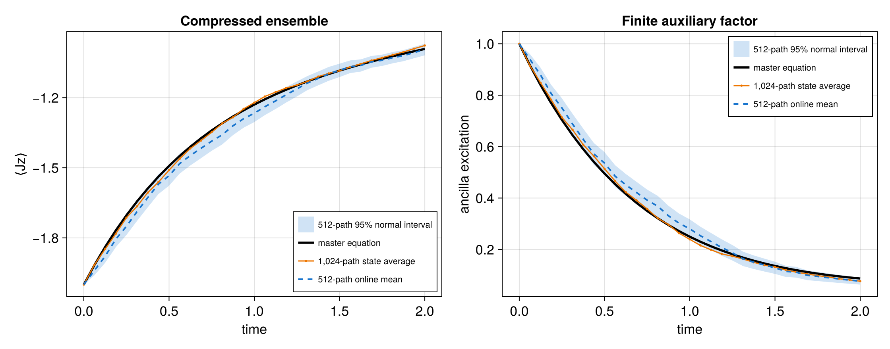

# Composite stochastic systems

The runnable source is
[`composite_quantum_trajectories.jl`](composite_quantum_trajectories.jl).
It demonstrates density-valued quantum-jump trajectories for a compressed PI
ensemble coupled to a finite auxiliary system.

## Model

Four identical qubits form one PI factor, while a distinguished two-level
ancilla is retained as a `FiniteOperatorBasis(2)`. The coherent background is

```math
H=g J_x\otimes\sigma_x,
```

and the monitored channel is

```math
L=J_-\otimes\sigma_-.
```

The complete ensemble generator is

```math
\mathcal L(\rho)=-i[H,\rho]+\gamma\mathcal D[L](\rho).
```

`CompositeTrajectoryPlan` receives the trace-preserving background separately
from `CompositeJumpChannel`. The background must not already contain the
monitored dissipator: the plan adds it when assembling
`composite_master_superoperator(plan)`. This explicit split prevents an
unverifiable double count of the gain channel.

## Matrix-free stochastic propagation

Every conditional state remains a `CompositePIState`. For a channel with
gain `G[rho]=L rho L'` and `Q=L'L`, the normalized no-jump drift is

```math
\dot\rho_c=\mathcal L_0(\rho_c)
-\frac{\gamma}{2}\{Q,\rho_c\}
+\lambda(\rho_c)\rho_c,
\qquad
\lambda(\rho_c)=\gamma\,\mathrm{tr}(Q\rho_c).
```

At a jump, the update is `G[rho]/tr(G[rho])`. The gain and both loss maps are
applied one tensor mode at a time. No global Kronecker superoperator and no
`2^N` ensemble Hilbert space are constructed. A workspace retains one shared
pair of full composite buffers for all channels; only small factor-fibre
scratch grows with the channel count.

Each channel hazard is integrated with the same RK4 stages as the conditional
state. If the resulting jump probability exceeds the configured cap, the
trial state is discarded and the step is retried at a smaller size. This is
important for driven rates that change appreciably inside one proposed step.
The classical RK4 update uses three full composite-vector registers; it does
not retain four separate derivative vectors per worker.

The default example compares 1,024 stochastic paths with deterministic RK4
evolution under `composite_master_superoperator(plan)` at 33 output times. It
also demonstrates observable-only online statistics and checks that serial
and threaded batches use identical trajectory-indexed random streams.

The numerical scratch is prepared once and reused across ensembles:

```julia
batch = CompositeTrajectoryBatchWorkspace(
    plan, rho0; workers=Threads.nthreads())
paths = quantum_trajectories(
    plan, rho0, times, npaths;
    dt, threaded=true, workspace=batch)
```

Every worker owns a `CompositeTrajectoryWorkspace` and RNG; the immutable
physical plan is shared. A separate single-worker workspace is reused for the
serial reproducibility check. Workspaces are task-owned and must not be used
concurrently.

## Expected output



Both panels compare the deterministic composite master equation with the
1,024-path density-state average and the independent 512-path state-free
online estimate. The shaded region is the online estimator's 95% normal
Monte Carlo interval for the displayed observable. It quantifies finite-path
sampling only: it does not include fixed-step integration error, jump-step
bias, model error, or auxiliary-truncation error.

Run it from the repository root:

```sh
julia --project=. examples/composite_quantum_trajectories.jl
```

Use the examples environment from [`README.md`](README.md) to save the
optional Makie figure. The root package environment still runs every
trajectory and assertion and skips only rendering.

Set `PID_EXAMPLE_QUICK=1` for the original nine-time smoke grid. The fixed
trajectory step, path counts, reproducibility check, and numerical tolerances
are unchanged; only the saved-output density and corresponding deterministic
steps per output interval differ.

## Interpretation and limits

These are density-valued trajectories. Unmonitored local PI channels in the
background can make an individual path mixed, even when a fully resolved
microscopic trajectory would be pure. The backend currently supports fixed
tensor-product jump operators and scalar time-dependent rates. It does not
infer an unraveling from an arbitrary assembled superoperator.

Finite auxiliary modes require an explicit truncation. Composite weak-PI
pseudo-kets, diffusive monitoring, adaptive event-time integration,
confidence-controlled stopping, and Distributed batches are separate future
extensions. Converge the fixed time step, maximum jump probability, auxiliary
truncation, and trajectory count independently.
