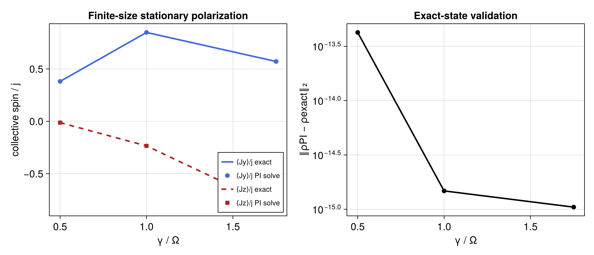

# Cooperative resonance fluorescence

Source: [`cooperative_fluorescence.jl`](cooperative_fluorescence.jl)

## Model

The driven collective spin obeys

\[
H=\Omega J_x,\qquad
\dot\rho=-i[H,\rho]+\frac{2\gamma}{N}\mathcal D[J_-]\rho .
\]

For `N = 20`, the example tests several damping strengths in the fully
symmetric sector.

## Solution

The model is compiled once per parameter point, and the numerical state comes
from the typed high-level call
`stationary_state(...; algorithm=DirectAlgorithm())`. It is compared with the
finite-size exact stationary density operator written in the paper as an
inverse collective-spin expression. The two spin observables share one
`OneBodyGeometry` and are prepared as `CollectiveObservablePlan`s. The example
reports the state distance and collective-spin expectations; its comments
document the axis and sign convention needed when comparing formulas.

## Makie figure

The optional CairoMakie output overlays the normalized numerical
polarizations with those obtained from the article's exact finite-size state.
A companion logarithmic panel shows the full PI coefficient-vector error, so
visual agreement of the two observables is backed by the stronger state-level
validation. PDF and PNG copies are saved as
`cooperative_fluorescence.*`.

## Run

```sh
julia --project=examples examples/cooperative_fluorescence.jl
```

Small residuals and state distance provide stronger validation than matching
a single observable.

## Expected output



The plotted observables are evaluated from the numerically solved state and
the independent analytical state used by the state-level validation.
