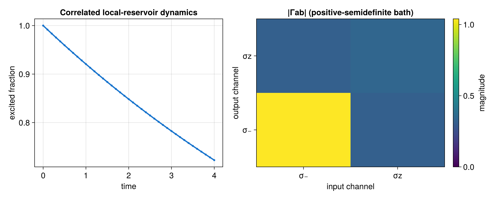

# Correlated Kossakowski reservoirs

The companion script models a qubit ensemble coupled to a reservoir whose
one-particle noise channels are correlated. Given local matrices (L_a) and
a Hermitian positive-semidefinite Kossakowski matrix (Gamma), the local
generator is

\[
\mathcal L_{\mathrm{corr}}(\rho)=
\sum_i\sum_{a,b}\Gamma_{ab}
\left[L_a^{(i)}\rho L_b^{(i)\dagger}
-\frac12\left\{L_b^\dagger L_a,\rho\right\}^{(i)}\right].
\]

Use `CorrelatedLocalJumps` for this incoherent sum over particles. Use
`CorrelatedCollectiveJumps` when (L_a^{(i)}) is first summed coherently into
(J_a=\sum_iL_a^{(i)}). The latter stays within each Schur sector, while the
local reservoir may transfer population between sectors.

```julia
mixing = ComplexF64[1.0 0.20im; 0.30 0.50]
gamma = mixing * mixing'

term = CorrelatedLocalJumps((sigma_minus, sigma_z), gamma; rate=0.08)
model = PIModel(basis, (term,))
prepared = compile(model; backend=:matrixfree)
```

For fixed (Gamma=C C^\dagger), the package factorizes the small channel-space
matrix once and lowers the effective operators
(K_r=\sum_a C_{ar}L_a) through the established exact PI kernels. This is
mathematically identical to a sum of `LocalJump(K_r)` or
`CollectiveJump(K_r)` terms. It neither diagonalizes a full many-particle
operator nor constructs a (d^N) state.

The full off-diagonal (Gamma_{ab}) entries matter: discarding them removes
interference between reservoir channels and generally changes the dynamics.
The constructor copies and checks fixed input, rejects nonfinite,
non-Hermitian, or non-positive-semidefinite matrices, and preserves the
working scalar precision. Negative common rates remain available for
deliberate time-local non-CP generators, as elsewhere in deterministic
dynamics; callable rates must remain representable in the precision selected
by the fixed operators and Kossakowski prototype.

The executable propagates the prepared local model with observable-only
output:

```julia
result = solve_dynamics(
    prepared, rho0, (first(times), last(times));
    saveat=times, observables=(excitation=excitation_operator,),
    save_states=false)
```

Only the excitation samples and one evolving PI vector are retained; the
41-state history is not stored.

## Preallocated time dependence

A raw `(time, parameters) -> gamma` function is supported through the
allocating freeze/lower compatibility path. For repeated evolution, provide a
fixed-shape `InPlaceTimeOperator`:

```julia
schedule = InPlaceTimeOperator(gamma, (destination, t, p) -> begin
    destination .*= 1 + p.ramp*t
    nothing
end)

driven_term = CorrelatedCollectiveJumps(
    (sigma_minus, sigma_z), schedule; rate=0.08)
```

Each `LiouvillianWorkspace` owns the evaluated Kossakowski matrix, residual
factorization scratch, and effective Schur blocks. The plan is read-only and
may be shared, but a workspace may be used by only one task at a time. Every
evaluated matrix is checked again for finite entries, Hermiticity, and
positive semidefiniteness before it acts on a state.

## Expected output



The left panel shows the excited fraction obtained from the state-free
observable stream. The right panel displays the magnitudes of the two-channel
Kossakowski matrix, including its nonzero cross correlations. This committed
image uses the default parameters; the sparse-factorization equality and
driven-kernel assertion in the script, rather than the pixels, are the
numerical regression.

Run the complete regression and evolution example with

```sh
julia --project=. examples/correlated_reservoirs.jl
```
