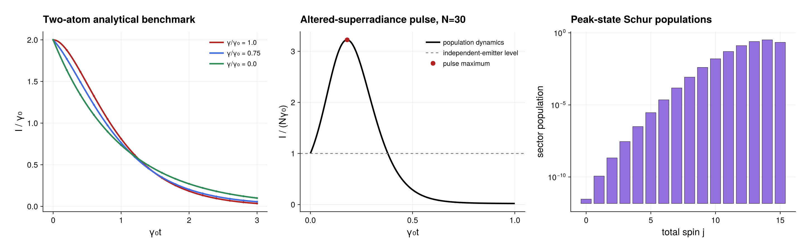

# Correlated superradiance from PRA 94, 033838

Source: [`correlated_superradiance.jl`](correlated_superradiance.jl)

## Model and radiated intensity

Damanet, Braun, and Martin describe correlated and independent spontaneous
emission with

```math
\mathcal L=\gamma\mathcal D[J_-]
+\Delta\gamma\sum_i\mathcal D[\sigma_i^-],
\qquad \Delta\gamma=\gamma_0-\gamma.
```

The normalized radiated energy rate in Eqs. (37)--(40) is

```math
I(t)=-\frac{d}{dt}\langle J_z\rangle
=\gamma\langle J_+J_-\rangle
+\Delta\gamma\sum_i\langle\sigma_i^+\sigma_i^-\rangle.
```

`correlated_superradiance_intensity_operator` constructs exactly this PI observable. In a
spin-$J$ state with magnetic number $M$, its diagonal value is

```math
c_{JM}=\gamma(J+M)(J-M+1)
+\Delta\gamma\left(M+\frac N2\right),
```

which is the coefficient in the paper's Eq. (40).

## Two-atom analytical validation

The first part recreates the three curves in Fig. 6 for
`gamma/gamma0 = 1, 0.75, 0`. It compiles the sparse PI generator and uses dense
exponentiation only for this independent, small-system reference route. Every
saved point is checked against Eqs. (41)--(43), including the pure collective
and independent-emission limits.

This deliberate low-level calculation should not be copied to a large system:
forming a dense Liouvillian or repeatedly exponentiating it would discard the
main computational advantage of the PI representation.

## The $N=30$ radiated-intensity pulse

The second part uses the largest size considered across Figs. 7--10 of the
paper, and the fixed size of Fig. 8,

```math
N=30,\qquad \frac{\Delta\gamma}{\gamma_0}=0.4,
\qquad \frac{\gamma}{\gamma_0}=0.6,
```

and starts from the fully excited product state. Emission does not create
coherences in the Schur/GT basis for this initial condition. Consequently,
`PopulationPlan(model)` certifies an exact closed evolution for the physical
probabilities

```math
p_{\nu,W}=f^\nu(\rho_\nu)_{W,W},\qquad
\sum_{\nu,W}p_{\nu,W}=1.
```

Only

```math
\sum_\nu \dim U_\nu=256
```

population coordinates are propagated, instead of the 5,456 coordinates of a
general PI operator or the $4^{30}$ entries of a full density operator. The
fixed-step calculation uses 16 RK4 steps between adjacent saved times. Halving
the step size and recomputing the full pulse changes every saved intensity by
less than $10^{-9}$ for the parameters in the script. Both solves reuse the
same certified population plan.

The intensity observable is also Schur diagonal. Its physical block diagonals
are prepared once with `each_schur_block`, after which every point of the pulse
is one dot product:

```julia
intensity_diagonal = reduce(vcat,
    (diag(block) for (_, block) in each_schur_block(intensity_operator)))
@assert maximum(abs, imag.(intensity_diagonal)) < 2e-12
intensity_weights = real.(intensity_diagonal)
intensity = [real(dot(intensity_weights, p))
             for p in population_solution]
```

The named tuple `pulse` retains the time, intensity, and the Fig. 7
normalization $I/(N\gamma_0)$ for plotting with any preferred plotting
package. The script verifies $I(0)=N\gamma_0$, population normalization, and
agreement between the reduced-coordinate dot product and a direct PI
expectation value at the pulse maximum. With the included grid, the maximum is
near $\gamma_0t=0.18$ and $I/(N\gamma_0)=3.2242$; these printed values are
numerical results, not hard-coded regression targets.

## Density operator in Schur blocks

Only the state at the intensity maximum is reconstructed as a `PIState`:

```julia
rho_peak = state(population_solution, peak_index)
peak_structure = schur_block_structure(
    rho_peak; metric=:population, threshold=1e-13)
```

`metric=:population` displays the physical trace carried by every Schur
sector,

```math
P_\nu=f^\nu\mathrm{tr}(\rho_\nu),
\qquad \sum_\nu P_\nu=1.
```

This is more meaningful for a state than an unweighted coefficient-block norm.
The diagram aggregates each Schur block to this trace weight; it is not an
entry-wise heat map of the matrix $\rho_\nu$.
Because $\Delta\gamma>0$, the unresolved local channel transfers population
out of the symmetric partition `(30,0)`; all 16 qubit sectors are visible at
the pulse maximum. The Young shape shown for each sector represents its
partition, while the tooltip records its exact symmetric-group multiplicity.
The calculation never materializes a length-$2^{30}$ state vector or a
$2^{30}\times2^{30}$ density matrix.

`visualize_schur_blocks` returns a dependency-free SVG display object.
SVG-capable VS Code Julia and notebook display front ends render
`display(peak_figure)` directly; a plain terminal prints its compact textual
summary. The script also verifies the SVG writer in a temporary directory. To
retain a copy, replace that temporary path or run, for example,

```julia
save_schur_block_visualization("correlated_superradiance_N30_peak_irrep_blocks.svg", peak_figure)
```

## Makie figure

The accompanying Makie figure has three panels: the `N=2` numerical markers
and analytical curves from Fig. 6, the normalized `N=30` radiated pulse and
its maximum, and the multiplicity-weighted Schur-sector populations at that
maximum on a logarithmic axis. It complements the detailed Young-diagram SVG
with a compact quantitative plot. The script saves
`correlated_superradiance.pdf` and `.png`.

## Run

From a checkout with its dependencies instantiated:

```sh
julia --project=examples examples/correlated_superradiance.jl
```

The example uses the package in the active checkout and does not modify the
project environment or install a second copy from GitHub.

## Expected output



The plotted `N=30` population solve and its step-doubling check are the same
data used by the assertions.
