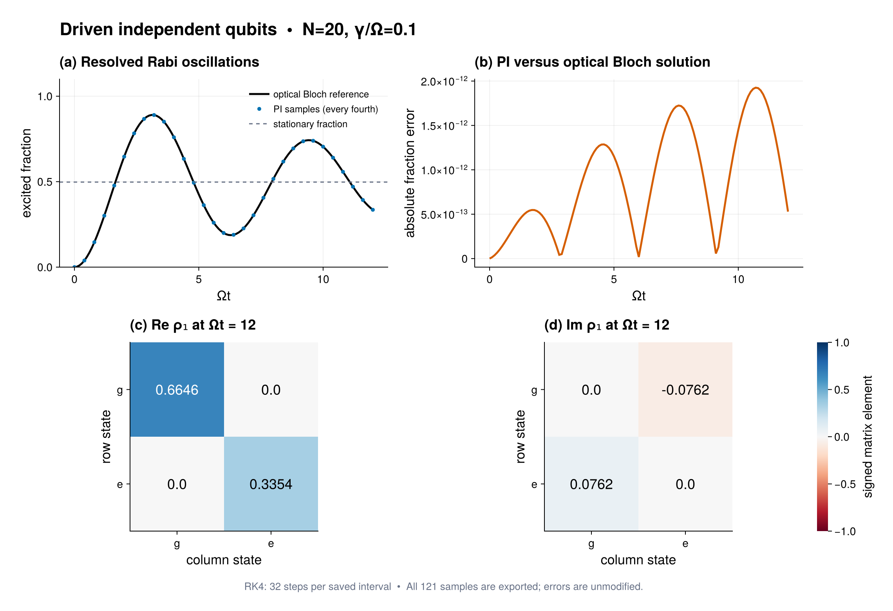

# Driven qubits with local decay

Source: [`driven_qubits.jl`](driven_qubits.jl)

## Model

The example considers `N = 20` identical qubits with

```math
H=\frac{1}{2}\sum_i\sigma_i^x,\qquad
\dot\rho=-i[H,\rho]+0.1\sum_i\mathcal D[\sigma_i^-]\rho .
```

Both sums are permutation invariant even though the decay channels are local.
The initial state is the product ground state.

## Prepared solution

The script constructs the model with `LocalHamiltonian` and `LocalJump`, then
calls

```julia
prepared = compile(model; backend=:matrixfree)
```

This lowers all fixed Schur geometry once without storing a Liouvillian
matrix. `solve_dynamics` propagates the typed `PIState` from `t = 0` to `12`
with fixed-step RK4, saves 121 states every `0.1`, and uses 32 RK4 steps between
successive saved times.

Two reusable analysis objects are prepared before propagation:

- `CollectiveObservablePlan` evaluates the total excited-state population at
  every saved state;
- `OneBodyRDMWorkspace` computes the complete final one-qubit density matrix
  in one geometry traversal.

Both share one `OneBodyGeometry`. This specialized one-particle route avoids
preparing the more general SU(2)/Littlewood--Richardson bipartition geometry
needed by `ReductionPlan`; use the latter for reductions to two or more
particles, purity, or negativity.

The script also calls `diagnostics` on the compiled model and the final state.
It asserts that the initial and final states are valid and that the reduced
state has unit trace.

## Expected output



The top panels show two resolved, damped Rabi oscillations and the absolute
excitation-fraction error against the one-qubit optical Bloch solution. Since
all sites evolve independently, a constant 3-by-3 affine generator for
`[p_e, Im(rho_ge), 1]` provides an exact reference independent of `N`. The
stationary fraction is $\Omega^2/(\gamma^2+2\Omega^2)$; the time axis is
$\Omega t$ with $\Omega=1$. Both the excitation curve and the complete final
one-qubit state must agree with this reference within `1e-9`.

The lower panels show **signed real and imaginary parts** of the final reduced
state with numerical cell labels, a shared diverging scale, and row/column
order `g, e`. Unlike a magnitude-only plot, these panels retain the coherence
phase. Every fourth PI sample is marked in the signal panel for readability;
all 121 samples contribute to the accuracy check and data export.

The optional output block writes `driven_qubits.tsv` with the sampled times,
PI and reference fractions, and unmodified errors. The companion
`driven_qubits_final_state.tsv` contains the complex matrix entries as separate
real and imaginary columns. Comment headers record the physical parameters
and numerical controls.

## Run

```sh
julia --project=. examples/driven_qubits.jl
```

The output reports the PI coordinate dimension, selected backend, excitation
reference error across all saved times, final one-body state, trace error, and
minimum sector eigenvalue. Increase `steps_per_interval` to verify RK4
convergence before using the result quantitatively.

Use the examples environment described in [`README.md`](README.md) to save
the optional PDF and PNG. The root package environment performs all numerical
checks and skips only Makie rendering.
