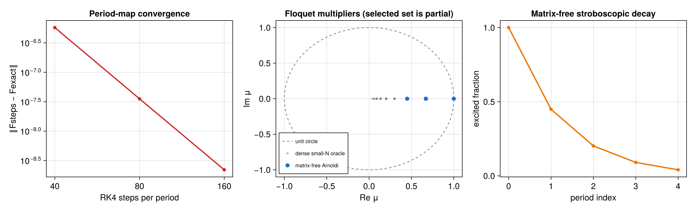

# Matrix-free Floquet dynamics with periodic decay

Source: [`floquet_periodic_decay.jl`](floquet_periodic_decay.jl)

## Model

Four qubits undergo independent spontaneous emission with a periodic rate

```math
\gamma(t)=0.4\left[1+0.7\cos(2\pi t/T)\right],\qquad T=2.
```

The one-period channel is the Floquet map
`F = T exp(integral_0^T L(t) dt)`.  Since every instantaneous generator in
this benchmark is proportional to the same decay generator, the exact small-
system reference is `exp(T*L_average)`.

## Reusable matrix-free period map

The model is prepared once and wrapped as a linear operator:

```julia
prepared = compile(model; backend=:matrixfree)
Fmap = floquet_map(prepared, period; steps=160)
work = FloquetWorkspace(Fmap)

y = similar(rho0.data)
apply!(y, Fmap, rho0.data, work)
```

`apply!` integrates one PI coefficient vector through one period.  It does
not retain the dense `n_PI`-by-`n_PI` propagator.  An explicit workspace owns
all RK4 and Liouvillian scratch, so independent tasks can share the map while
using one workspace each.  The matching `apply_adjoint!` is the exact reverse
of the finite-step RK4 computation graph; it is therefore the numerical
adjoint of the chosen discrete map, including for noncommuting driven terms.

The script repeats the integration with 40, 80, and 160 steps and constructs
a dense map only as a small-`N` validation oracle.  For a research-sized
calculation, omit both `floquet_propagator` and the analytical matrix
exponential.

## Selected multipliers and a trace-fixed periodic state

Slow multipliers are extracted from matrix-free period products:

```julia
selected = selected_floquet_multipliers(
    Fmap; nev=4, method=:arnoldi,
    krylovdim=length(basis), atol=1e-10, rtol=1e-9)

gap = floquet_gap(
    Fmap; return_info=true, nev=4, method=:arnoldi,
    krylovdim=length(basis), atol=1e-10, rtol=1e-9)
```

The result retains recomputed Ritz residuals.  With only four selected roots,
`gap.global_gap_certified` is false: residual convergence certifies the
returned modes but a partial edge calculation cannot prove that an omitted
mode is not slower.  Requesting the scalar gap without `return_info=true`
therefore refuses a partial result.  Complete small maps, or an independently
justified invariant subspace containing the complete spectral edge, can give
a global certificate.

The periodic state is obtained without materializing `F-I`:

```julia
steady = floquet_steady_state(
    Fmap; return_info=true, krylovdim=20, maxiter=400,
    atol=1e-11, rtol=1e-9)
rhoF = steady.state
```

This is restarted GMRES on the trace-fixed equation `(F-I)rho=0`.  Its
reported period residual, trace error, and RK step convergence are separate
checks.

## Certified parity restriction

Local decay commutes with conjugation by the global parity operator, although
the jump itself changes Hilbert-space parity.  The even Liouville charge is
the union of the `(+,+)` and `(-,-)` ket/bra charge blocks.  The example
constructs that coordinate union and calls

```julia
restricted = restricted_floquet_map(Fmap, even_restriction)
rho_even = floquet_steady_state(restricted; return_info=true)
```

Preparation probes every retained coordinate and rejects the restriction if
one-period evolution leaks out of it.  Krylov vectors then have only the
reduced dimension, while every period application uses caller-owned ambient
scratch.  The returned state is embedded in the full PI basis and includes a
full-space leakage residual.

Finally, `stroboscopic_evolution(rho0, Fmap, 4)` reuses the same operator to
sample periods zero through four.  The example checks the analytical map,
selected Ritz values, the decay rate `0.2`, both periodic-state solves, and
density-operator diagnostics.

## Expected output



The three panels show RK4 period-map convergence, the dense small-system and
selected matrix-free multipliers, and stroboscopic excitation decay. The unit
circle is a stability reference. The four Arnoldi multipliers remain a
partial spectral result, as the panel title states; the picture does not turn
the reported gap into a global certificate. Plotting reuses the maps,
multipliers, and trajectory already evaluated by the assertions.

## Run

```sh
julia --project=. examples/floquet_periodic_decay.jl
```

For noncommuting drives, repeat the calculation with a finer period grid.
Then increase the Krylov dimension or restart budget separately; RK and Ritz
errors are independent.
