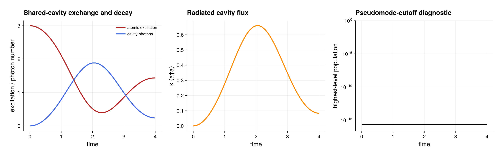

# One shared damped cavity coupled to a PI ensemble

The runnable source is
[`global_pseudomode_cavity.jl`](global_pseudomode_cavity.jl). It uses only the
package and Julia standard libraries:

```sh
julia --project=. examples/global_pseudomode_cavity.jl
```

## Model

Three identical two-level emitters interact with one shared truncated cavity.
In a resonant rotating frame, the master equation is

```math
\dot\rho=-i[H_{\mathrm{TC}},\rho]+\kappa\mathcal D[a]\rho,
\qquad
H_{\mathrm{TC}}=g(J_-a^\dagger+J_+a),
```

where $J_-=\sum_i\sigma_-^{(i)}$ and
$\mathcal D[a]\rho=a\rho a^\dagger-\{a^\dagger a,\rho\}/2$. The script
starts with every emitter excited and the cavity in vacuum.

This is a **global** pseudomode: permutations act on the emitters and leave
the one distinguished cavity unchanged. The exact operator coordinate is

```text
PI system operator space x finite cavity operator space
```

and has `length(system_basis) * (nmax + 1)^2` entries. It is not the local
supersite model in which emitter `i` has its own independent mode `i`.

## Workflow

`global_pseudomode_model` lifts the local lowering matrix to $J_-$ without
inserting a Kac or other $N$-dependent factor. Its prepared fields have
separate roles:

- `background` contains the system generator, cavity Hamiltonian, and coherent
  interaction;
- `damping_channels` contains the explicit cavity loss/gain channels;
- `generator` contains both and is used for deterministic evolution;
- `mode_operators` contains the finite cavity matrices.

The example uses `time_evolution(model.generator, ...)`, then evaluates
factorized observables for atomic excitation, cavity occupation, radiated flux
$\kappa\langle a^\dagger a\rangle$, and population of the highest retained
cavity level. `trace_pseudomodes` returns the reduced PI emitter state, while
`global_pseudomode_state` returns the dense reduced cavity state. The latter is
checked against the generic `composite_reduced_state(rho, 2)` contraction.

## Expected output



The left panel follows the exchange and decay of atomic excitations and shared
cavity photons. The middle panel shows the emitted cavity flux
$\kappa\langle a^\dagger a\rangle$. The logarithmic right panel monitors the
population of the highest retained oscillator level; the plotted floor only
makes exact numerical zeros visible and does not alter the computed array.
This preview uses the default `N = 3`, coupling, damping, cutoff, time grid,
and RK4 resolution. For a different driven, thermal, or counter-rotating
model, converge the cutoff and time step separately rather than relying on
this unreachable-level check.

## Cutoff check

The script chooses `nmax=N+1`. Under the rotating-wave Hamiltonian, the
initial state has only $N$ excitations and the level $n=N+1$ is
unreachable. Its top-level population should therefore remain at roundoff.
For a driven, thermal, or counter-rotating calculation this argument no longer
applies: increase `nmax` and compare physical observables and reduced states
between successive cutoffs.

See the [global-pseudomode guide](../docs/src/global_pseudomodes.md) for the
shared-mode/local-mode/HEOM comparison and matrix-free workspace API.

Use the examples environment described in [`README.md`](README.md) to save
the optional PDF and PNG figure. Running from the root package environment
keeps the calculation dependency-free and skips only rendering.
