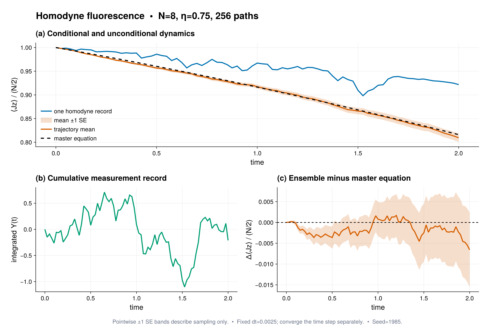

# Homodyne PI trajectories

Source:
[`homodyne_pi_trajectories.jl`](homodyne_pi_trajectories.jl)

This example conditions a collectively decaying qubit ensemble on an
inefficient homodyne fluorescence record.  It implements the normalized Itô
stochastic master equation

```math
d\rho_c=\mathcal L[\rho_c]dt+
\sqrt{\eta}\,\mathcal H[e^{-i\phi}c]\rho_c\,dW,
```

used in the quantum-trajectory treatment of continuous optical measurements
by Wiseman and Milburn.  Here $c=\sqrt{\gamma}J_-$ and the unconditional
model already contains $\gamma\mathcal D[J_-]$.

The script compares one conditional magnetization path, the average of 256
independent records, and direct PI master-equation evolution.  It verifies
normalization and checks ensemble/master agreement against the measured Monte
Carlo standard error.  No $2^N$ state or Liouville matrix is constructed.

The Makie figure shows the conditional and unconditional magnetization in the
upper panel and the cumulative homodyne record in the lower panel.

Run with:

```sh
julia --project=examples examples/homodyne_pi_trajectories.jl
```

## Expected output



The ensemble curve and sampling band use the script's fixed seed and default
trajectory count; reduce the time step before interpreting a changed setup.
