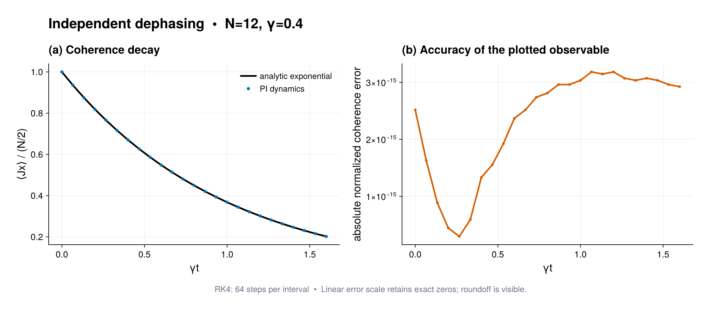

# Coherence decay under independent dephasing

Source: [`independent_dephasing_coherence.jl`](independent_dephasing_coherence.jl)

## Model

Following Huelga *et al.* (1997), `N = 12` qubits start in
`|+x>^N` and undergo independent Markovian dephasing. With the convention used
by the example,

```math
\dot\rho=\frac{\gamma}{2}\sum_i\mathcal D[\sigma_i^z]\rho,
\qquad
\langle J_x(t)\rangle=\frac N2 e^{-\gamma t}.
```

## Solution

Use `LocalJump(σz, γ/2)` to preserve all Schur sectors generated by local
noise. The model is prepared once with `compile(...; backend=:matrixfree)` and
`solve_dynamics` propagates the PI state to the requested grid with the
preallocated fixed-step RK4 path. A `CollectiveObservablePlan` prepares the
Schur blocks of `Jx` once and is reused for every saved state:

```julia
prepared = compile(model; backend=:matrixfree)
solution = solve_dynamics(prepared, rho0, (first(times), last(times));
                          saveat=times, steps_per_interval=64)
Jx = CollectiveObservablePlan(b, sx/2)
numeric = [collective_expectation(rho, Jx) for rho in solution]
```

This workflow never expands the density matrix into the full computational
basis. `diagnostics(last(solution))` verifies trace, Hermiticity, and
positivity of the final numerical state without altering it.

## Makie figure

When CairoMakie is available, the script creates a two-panel figure. The first
panel overlays the normalized PI coherence with the analytical exponential
as a function of the dimensionless time `gamma*t`. The second shows the
pointwise absolute discrepancy used in the printed convergence report. Vector
PDF and raster PNG copies are saved as
`independent_dephasing_coherence.pdf` and `.png`.

## Run and validation

```sh
julia --project=examples examples/independent_dephasing_coherence.jl
```

The printed maximum error compares every saved numerical value with the
analytic exponential. This is also a useful convention check for factors of
two in a dephasing dissipator. Increase `steps_per_interval` until the reported
error is converged when changing the time grid or rates. Without CairoMakie,
all numerical checks still run and only figure rendering is skipped.

## Expected output



The markers are the PI evolution for the default controls and the line is the
analytical exponential used by the numerical assertion.
