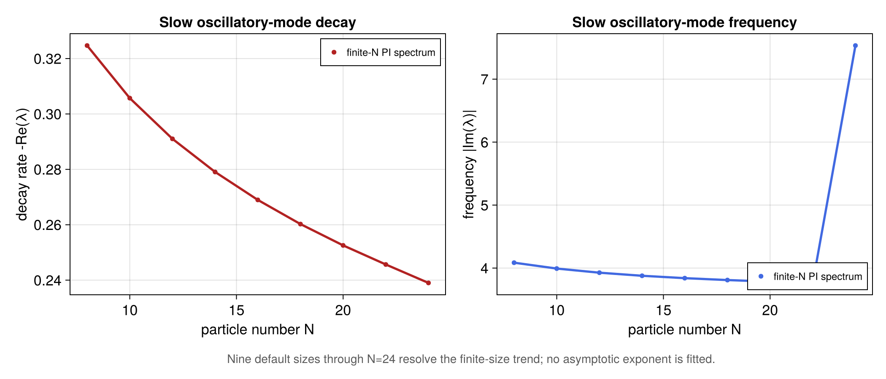

# Interacting boundary time crystal

Source: [`interacting_boundary_time_crystal.jl`](interacting_boundary_time_crystal.jl)

## Model and normalization

Piccitto, Wauters, Nori, and Shammah study fully connected spin models with a
collective bath. Their normalized collective variables are

```math
J_\alpha=\frac{1}{N}\sum_{i=1}^N\sigma_i^\alpha,
\qquad
J_\pm=J_x\pm iJ_y=\frac{2}{N}\sum_{i=1}^N\sigma_i^\pm .
```

For the `p = 2`, `q = 1` case used here,

```math
H=-N\left(\omega_zJ_z^2+\omega_xJ_x\right)
  =-\frac{\omega_z}{N}\left(\sum_i\sigma_i^z\right)^2
   -\omega_x\sum_i\sigma_i^x,
```

and the collective master equation is

```math
\dot\rho=-i[H,\rho]
 +N\Gamma^\uparrow\mathcal D[J_+]\rho
 +N\Gamma^\downarrow\mathcal D[J_-]\rho .
```

The library constructor removes only the identity part of
`(sum sigma_z)^2`, which has no effect on a commutator. The remaining
interaction is represented by an Appendix-D two-body Hamiltonian with rate
`-2omega_z/N`, while the transverse term is a one-body Hamiltonian with rate
`-omega_x`. Because the library's collective jump is the unnormalized
`sum sigma_i^+` or `sum sigma_i^-`, the paper's normalized `J_+/-` gives
library jump rates `4Gamma_up/N` and `4Gamma_down/N`.

All terms preserve total spin. Restricting `PIBasis` to the fully symmetric
Schur sector is therefore exact, rather than a state-space truncation.

## Finite-size spectral comparison

The script chooses the oscillatory parameters used in Figs. 6 and 8,

```math
\omega_x=3\omega_z,\qquad
\Gamma^\uparrow-\Gamma^\downarrow=0.2\omega_z,
\qquad \Gamma^\downarrow=0,
```

and computes complete PI Liouvillian spectra at the nine even sizes from
`N = 8` through `N = 24`. At each size it selects the oscillatory eigenvalue
with largest real part and reports

- its decay rate `-real(lambda)`;
- its frequency `abs(imag(lambda))`;
- the complex-conjugate pairing error.

The decay rate decreases over this finite-size sequence, while the frequency
remains nonzero. This is the small-system precursor of the paper's result:
the complex branch approaches the imaginary axis with increasing `N`, and
its frequency tends to a finite value. The paper reports an approximately
`N^-0.4` decay over substantially larger sizes. The script deliberately does
not fit that exponent from this bounded finite-size grid.

The selector is intentionally reapplied at every size: it always returns the
oscillatory mode with largest real part. Near `N = 24`, two oscillatory
branches have almost equal decay rates and exchange order, so the frequency
panel shows a branch crossing rather than enforcing an artificially smooth
continuation.

Complete dense spectra are used only because the default grid is bounded at
`N = 24` and the comparison needs to identify a particular complex branch
without a selected-mode assumption.
For larger `N`, compile matrix-free and use
`liouvillian_spectrum(...; target=:largest_real, algorithm=:arnoldi)` with a
converged Krylov dimension. Harmonic extraction *near zero* can miss the slow
oscillatory branch because its imaginary part remains finite.

## Makie figure

When CairoMakie is available, the script creates a two-panel finite-size
spectral summary. The first panel shows the decay rate of the selected slow
oscillatory mode; the second shows its frequency. The panels display all nine
computed sizes directly and do not fit the asymptotic exponent reported in the
paper. Thus the figure visualizes a finite-size precursor, not evidence by
itself for persistent thermodynamic oscillations.

Vector PDF and raster PNG copies are written as
`interacting_boundary_time_crystal.*` in the configured example-figure
directory.

## Run

```sh
julia --project=examples examples/interacting_boundary_time_crystal.jl
```

Set `PID_EXAMPLE_QUICK=1` to retain the original `N = 8, 12, 16` smoke grid.
The quick branch uses the same complete-spectrum solver and numerical checks.

The core numerical assertions can also be run with `--project=.`; if
CairoMakie is unavailable, only figure generation is skipped.

Reference: A. Piccitto, M. Wauters, F. Nori, and N. Shammah,
*Symmetries and conserved quantities of boundary time crystals in generalized
spin models*, [Phys. Rev. B **104**, 014307 (2021)](https://doi.org/10.1103/PhysRevB.104.014307).

## Expected output



The nine finite sizes and selected modes are the checked defaults;
larger-size claims require a separately converged selected-mode calculation.
