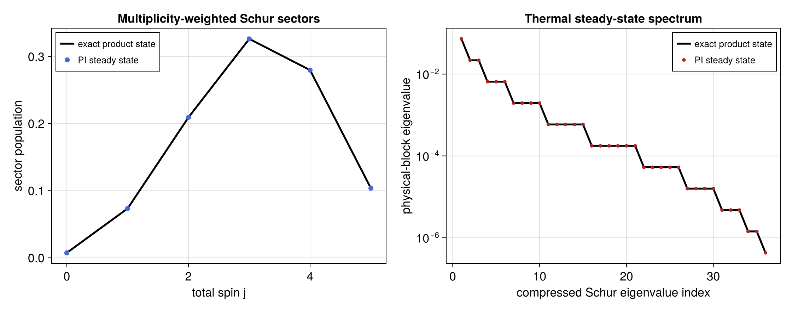

# Independent pumping and emission

Source: [`local_pumping.jl`](local_pumping.jl)

## Model

Ten qubits experience independent emission at rate `γ↓ = 1` and pumping at
rate `γ↑ = 0.3`:

\[
\dot\rho=\gamma_\downarrow\sum_i\mathcal D[\sigma_i^-]\rho
+\gamma_\uparrow\sum_i\mathcal D[\sigma_i^+]\rho .
\]

The exact stationary state is the product of identical diagonal one-qubit
states with excited population `γ↑/(γ↓+γ↑)`.

## Solution

Add two `LocalJump` terms, prepare their common Schur geometry once, and call
the typed high-level stationary-state solver:

```julia
prepared = compile(model)
result = stationary_state(prepared; return_info=true)
numeric = result.state
```

The returned `SteadyStateResult` exposes the physical `PIState` together with
the selected method, convergence flag, stationarity residual, and trace error.
The example checks convergence and `diagnostics(numeric).valid`, constructs the
exact iid PI state independently, and compares their density operators. This
exercises multiple Schur sectors: restricting to the fully symmetric sector
would be incorrect for independent incoherent processes.

For visualization, `schur_block_structure(...; metric=:population)` extracts
the multiplicity-weighted trace carried by each total-spin sector. The
compressed density spectra are obtained with `pi_density_spectrum`; they keep
one physical-block eigenvalue and its exact degeneracy rather than expanding a
length-`2^N` eigenvalue list.

## Makie figure

The optional Makie figure compares the numerical and exact total-spin sector
populations in its first panel. Its second panel overlays their sorted,
multiplicity-compressed physical Schur-block spectra on a logarithmic scale.
Agreement in both views checks more structure than the scalar state error
alone while remaining in PI coordinates. PDF and PNG copies are saved as
`local_pumping.*`.

## Run

```sh
julia --project=examples examples/local_pumping.jl
```

The trace, positivity, Liouvillian residual, and distance to the exact product
state provide complementary checks of the numerical solution. Without
CairoMakie, those checks and the compressed diagnostics still run; only figure
rendering is skipped.

## Expected output



The numerical points use the default finite ensemble and are compared with the
exact product-state prediction.
