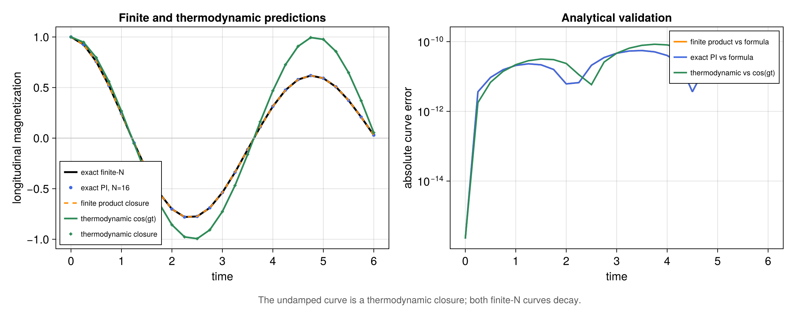

# Mean-field prediction for a dissipative time crystal

Source: [`meanfield_time_crystal.jl`](meanfield_time_crystal.jl)

Literature: Y. Nakanishi and T. Sasamoto, *Phys. Rev. A* **107**, L010201
(2023), [arXiv:2203.06672](https://arxiv.org/abs/2203.06672).

## Purpose

This example places three related but different predictions on the same
numerical footing:

1. the finite-\(N\) product-state closure generated by `MeanFieldPlan`;
2. the exact finite-\(N\) one-body result of the balanced model; and
3. the leading thermodynamic mean-field result.

It also evolves the exact finite-\(N\) PI density operator with the matrix-free
backend. Agreement in this example is a model-specific analytical property of
the balanced generator. A product closure is not generally exact for a finite
PI state at later times.

## Balanced collective model

The paper studies

\[
\mathcal L\rho=-ig[S_x,\rho]
+\frac{\kappa}{S}\mathcal D_{\rm paper}[S_x^+]\rho
+\frac{\kappa}{S}\mathcal D_{\rm paper}[S_x^-]\rho,
\qquad S_x^\pm=S_y\pm iS_z,
\]

at the balanced point \(p=0\). The paper uses
\(\mathcal D_{\rm paper}=2\mathcal D_{\rm std}\), while the library uses the
standard Lindblad dissipator. With \(S=N/2\), each package `CollectiveJump`
therefore has rate \(4\kappa/N\). The reusable constructor
`nakanishi2023_pt_model` contains this convention conversion.

For an initially polarized state, the exact finite-size result is

\[
m_z^{(N)}(t)=e^{-4\kappa t/N}\cos(gt).
\]

At every finite \(N\), the oscillation decays. Its decay rate closes as
\(N^{-1}\); persistent time-crystalline oscillations are an infinite-size
statement.

## Why the two mean-field limits differ

For a collective one-particle jump \(J=\sum_i L_i\), the finite product
closure contains both the one-site dissipator and the field generated by the
other \(N-1\) particles:

\[
\dot\sigma\big|_J=r\left[
\mathcal D[L]\sigma+
\frac{N-1}{2}\left(
\ell^*[L,\sigma]-\ell[L^\dagger,\sigma]
\right)\right],
\qquad \ell=\mathrm{tr}(L\sigma).
\]

In the balanced Nakanishi--Sasamoto model the nonlinear fields of
\(S_x^+\) and \(S_x^-\) cancel. The remaining one-site dissipators give the
finite decay \(4\kappa/N\), so `limit=:finite` reproduces the formula above.

`limit=:thermodynamic` retains the leading collective field, replaces
\(N-1\) by \(N\), and drops the subleading one-site dissipator. The two
balanced fields still cancel, leaving only rotation around \(x\):

\[
m_z^{(\infty)}(t)=\cos(gt).
\]

This option does not infer how arbitrary numerical rates scale with \(N\).
Here the constructor explicitly supplies the required Kac scaling
\(r=4\kappa/N\).

## Efficient workflow

The two closures reuse the same physical `PIModel` terms:

```julia
finite = MeanFieldPlan(model; limit=:finite)
thermodynamic = MeanFieldPlan(model; limit=:thermodynamic)

finite_solution = solve_meanfield(
    finite, sigma0, (0.0, 6.0);
    saveat=times, steps_per_interval=48)
```

Mean-field evolution stores a single \(2\times2\) density matrix. The exact
comparison uses the symmetric PI sector, whose Liouville dimension is
\((N+1)^2\), and compiles it only once with `backend=:matrixfree`.

For a hot loop, the script constructs caller-owned scratch explicitly:

```julia
workspace = MeanFieldWorkspace(finite, sigma0)
du = zeros(eltype(workspace), size(sigma0))
meanfield_rhs!(du, finite, sigma0, 0.0, nothing, workspace)
```

One workspace must be owned by only one task at a time. The plan is read-only
and may be shared. The script also uses `meanfield_expectation` and
`meanfield_collective_moments`; the latter reports the collective first and
second moments predicted by the product ansatz.

## Interpretation

The finite closure agrees with the exact PI one-body curve here because the
balanced dynamics closes on the relevant collective-spin component. The
script does not claim that the complete finite PI density operator remains a
tensor product, nor that finite and thermodynamic closures agree for a general
collective generator.

The thermodynamic curve is an undamped mean-field prediction, not evidence
that a chosen finite \(N\) already realizes a persistent time crystal. The PI
spectrum and size scaling remain the appropriate finite-system checks.

## Makie figure

With CairoMakie available, the main panel overlays the exact finite-`N`
formula, exact matrix-free PI dynamics, finite product closure, and
thermodynamic closure. The companion logarithmic panel shows the pointwise
errors against the corresponding analytical curves. Its machine-precision
floor is used only for plotting exact zeros; the numerical arrays and
assertions are not clipped.

The annotation distinguishes the undamped thermodynamic prediction from the
decaying finite-`N` curves. Consequently, the figure does not treat
mean-field persistence as finite-size evidence for a time-crystal phase. PDF
and PNG files are saved as `meanfield_time_crystal.*` in the configured
example-figure directory.

## Run

```sh
julia --project=examples examples/meanfield_time_crystal.jl
```

The root environment remains sufficient for the numerical checks; without
CairoMakie, the script simply omits the optional figure.

## Expected output



The error panel is evaluated from the same arrays as the assertions. The
undamped curve is a thermodynamic closure, while the two finite-`N` curves
decay.
