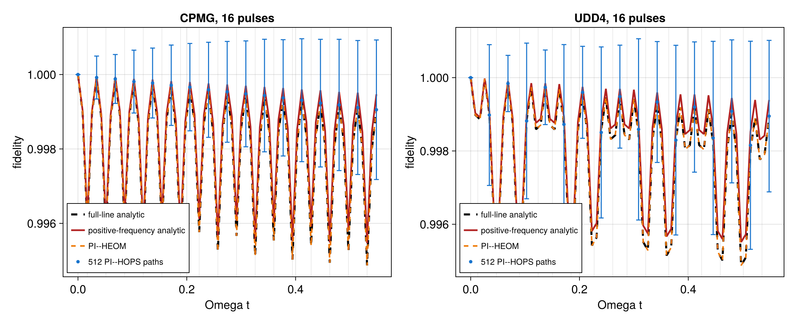

# Non-Markovian dynamical decoupling with PI--HOPS and PI--HEOM

This example compares ideal dynamical-decoupling sequences for a qubit
coupled to a structured dephasing bath. It uses both stochastic PI--HOPS and
deterministic PI--HEOM, and checks them against the exact filter-function
solution for the same one-exponential bath correlation.

The model and comparison are based on Colin Read,
*Studying pure dephasing and dynamical decoupling: comparison of the HOPS
method with exact analytical solutions* (report, September 2023), especially
Eqs. (15), (47)--(52) and Figs. 8--9. No journal venue or DOI is stated in the
supplied report, so none is inferred here.

The executable script is
[`nonmarkovian_dynamical_decoupling.jl`](nonmarkovian_dynamical_decoupling.jl).
Backend conventions and hierarchy ownership are documented in
[Permutationally invariant HEOM](../docs/src/heom.md) and
[Permutationally invariant HOPS](../docs/src/hops.md).
It is a qualitative reconstruction of the comparison in Figs. 8--9, not a
pixel reproduction. The report does not specify the Gaussian pulse width or
the value of the bare qubit frequency used for its finite-pulse HOPS curves.
The example therefore uses the ideal instantaneous pulses assumed in the
analytical filter-function derivation.

## Lorentzian model and the frequency-domain caveat

The report uses the zero-temperature Lorentzian spectral density

```math
J(\omega)=\frac{g\kappa}{2}
 \frac{\kappa}{(\omega-\omega_c)^2+\kappa^2}.
```

Its positive-frequency bath correlation is

```math
C_+(t)=\frac{1}{\pi}\int_0^\infty
 J(\omega)e^{i\omega t}\,d\omega .
```

This function is not exactly one exponential. Extending the Lorentzian to
the whole real frequency axis instead gives

```math
C_{\mathrm{full}}(t)=\frac{1}{\pi}\int_{-\infty}^{\infty}
 J(\omega)e^{i\omega t}\,d\omega
 =c e^{-\nu t},
\qquad
c=\frac{g\kappa}{2},\quad
\nu=\kappa-i\omega_c.
```

The finite one-pole HOPS and HEOM calculations in this example implement
$C_{\mathrm{full}}$, including the negative-frequency tail of the extended
Lorentzian. Consequently, the numerical hierarchy results are validated
against the exact **full-line** one-pole filter reference. Agreement between
PI--HOPS and PI--HEOM does not turn this model into the physical
positive-frequency correlation $C_+$. This is precisely the distinction
highlighted in the report: the extension can even change the apparent
ordering of two nearly equivalent pulse sequences.

For comparison, the script also evaluates the physical positive-frequency
filter integral directly. A rational map sends a Gauss--Legendre rule to
$[0,\infty)$, avoiding an arbitrary hard frequency cutoff. Two quadrature
orders are compared before the curve is accepted. This red
positive-frequency curve is an analytical postprocessing calculation; it is
not produced by either one-pole hierarchy.

For a toggling function $y(t)=\pm1$ that changes sign at every pulse, the
zero-temperature exponent used for this curve is

```math
\Gamma_+(t)=\frac{2}{\pi}\int_0^\infty
J(\omega)\left|
\int_0^t y(s)e^{i\omega s}\,ds
\right|^2d\omega .
```

The corresponding ideal-pulse fidelity is
$F_{+x}(t)=[1+\exp(-\Gamma_+(t))]/2$. The full-line reference evaluates the
same filter for $C_{\mathrm{full}}$ through a stable piecewise
exponential-memory recurrence rather than a cutoff-dependent frequency
integral.

The dimensionless parameters follow the report:

```math
\omega_c=10,\qquad
\kappa=1.5,\qquad
g=\frac{1.6\,\omega_c^2}{\kappa},\qquad
T_c=\frac{2}{7\omega_c}.
```

The code therefore supplies the common correlation data
`coefficient = g*kappa/2` and
`frequency = kappa - im*omega_c` to both hierarchy backends. A complex pole
with positive real part is supported. The coefficient remains real and
positive, so PI--HOPS can use its built-in stationary complex
Ornstein--Uhlenbeck process. A general complex or negative exponential
coefficient would instead require an externally prepared noise process with
the covariance of the complete target correlation.

For the Hermitian HEOM coupling, `HEOMBath` also prepares the conjugate right
correlation on its common pole list. This does not add a second term to the
specified left correlation $C_{\mathrm{full}}$. `HOPSBath` is constructed
directly from that same left coefficient and pole.

Time is displayed in units of the report's characteristic frequency

```math
\Omega=\frac{g\kappa^2}{\omega_c^2}.
```

## Coupling and pulse normalization

The report writes the interaction with the Pauli matrix $\sigma_z$. The
package spin helper uses

```math
j_z=\frac{\sigma_z}{2},
```

so the matching coupling is constructed from `2 * spin.jz`. For $N$
particles this becomes the collective operator

```math
Q=\sum_{i=1}^N \sigma_z^{(i)}=2J_z.
```

No Kac factor or other $N$-dependent rescaling is inserted.

An ideal $\pi$ pulse about $x$ is

```math
U_x=\exp(-i\pi j_x)=-i\sigma_x.
```

`PIUnitaryPulse(basis, Ux)` lifts the local matrix to
$U_x^{\otimes N}$ directly in Schur space. `HierarchyPulseSequence` stores
the ordered event times. The hierarchy solvers apply an event to every
auxiliary:

- PI--HEOM maps every ADO as
  $\rho_{\boldsymbol n}\mapsto U_x\rho_{\boldsymbol n}U_x^\dagger$;
- PI--HOPS maps every auxiliary pseudo-ket as
  $\psi_{\boldsymbol n}\mapsto U_x\psi_{\boldsymbol n}$.

Thus a pulse does not discard bath memory or restart the colored noise. A
pulse exactly at a requested output time is applied before that state is
saved, so saved event-time states use a documented post-pulse convention.
If a nominal RK4 or HOPS step would cross an event, the pulse-aware driver
splits that step at the exact event time; pulse times need not be rounded to
the unpulsed integration grid.

The two-pulse CPMG sequence places pulses at $T_c/4$ and $3T_c/4$ in every
period. The four-pulse UDD4 positions in a period $T$ are

```math
t_j=T\sin^2\left(\frac{j\pi}{10}\right),
\qquad j=1,\ldots,4.
```

Following Fig. 9, one UDD4 period spans the same time and uses the same number
of pulses as two CPMG periods.

## TEDD constructor and algebraic check

The executable also constructs one tetrahedral Eulerian dynamical-decoupling
cycle with

```julia
tedd_interval = comparison_period / 24
tedd = tetrahedral_pulse_sequence(basis, tedd_interval)
```

This is the published 24-pulse TEDD word of Read, Serrano-Ensástiga, and
Martin, *Platonic dynamical decoupling sequences for interacting spin
systems*, *Quantum* **9**, 1661 (2025),
[DOI: 10.22331/q-2025-03-12-1661](https://doi.org/10.22331/q-2025-03-12-1661).
Each event is one of two prepared tetrahedral generators, lifted directly to
the retained Schur blocks.

TEDD uses noncommuting rotation axes. It therefore cannot be inserted into
the scalar $y(t)=\pm1$ CPMG/UDD filter formula above. The example checks the
property TEDD is designed to provide. If $G_k$ is the cumulative control
before edge $k$, its Eulerian Cayley cycle traverses every directed edge once
and samples each of the 12 tetrahedral vertices twice. Its 24 toggling frames
therefore satisfy

```math
\frac{1}{24}\sum_{k=1}^{24}G_k^\dagger QG_k
=\frac{\mathrm{tr}(Q)}{2}I.
```

For the dephasing coupling $Q=\sigma_z$, the right-hand side is zero. The
script forms this zeroth-order average-Hamiltonian (leading Magnus-term)
check explicitly in the one-qubit Schur block and asserts that its
infinity-norm residual is below numerical roundoff. It also verifies that the
complete pulse product is a phase times the identity. Finally, the same
immutable event schedule is passed through zero-generator, depth-zero HEOM
and HOPS evolutions; both reconstructed root densities must return to the
initial state after the last cyclic pulse. Randomized non-root auxiliary
transforms are covered separately by the pulse API unit tests.

These are exact sequence-construction and event-driver checks. For this
specific traceless coupling they establish zeroth-order group symmetrization
and cyclic closure, not universal TEDD performance, finite-width-pulse
robustness, higher-Magnus-order cancellation, or exact cancellation of a
finite-correlation-time bath at a nonzero pulse interval. A dynamical TEDD
comparison requires its own matrix-valued toggling-frame calculation or a
converged hierarchy calculation; the scalar CPMG/UDD reference must not be
reused for it.

## PI--HEOM and PI--HOPS setup

The central package calls have the following form:

```julia
basis = PIBasis(N, 2)
spin = spin_matrices()
Q = collective_operator(basis, 2 * spin.jz)
Ux = exp(-im * pi * spin.jx)
pulse = PIUnitaryPulse(basis, Ux)
sequence = HierarchyPulseSequence(pulse_times, pulse)

rho0 = iid_pure_state(basis, ComplexF64[1, 1] / sqrt(2))
psi0 = weak_pi_pseudoket(rho0)

system = PIModel(basis, ())
heom_bath = HEOMBath(Q, coefficient, frequency)
heom_plan = HEOMPlan(
    system, heom_bath; max_depth=6, scaling=:scaled)
heom_states = heom_time_evolution(
    heom_plan, rho0, times;
    steps_per_interval=6, pulses=sequence)

H = PIOperator(basis; T=Float64)
hops_bath = HOPSBath(Q, coefficient, frequency)
hops_plan = HOPSPlan(
    H, hops_bath; max_depth=6, scaling=:scaled)
hops_result = hops_average(
    hops_plan, psi0, times, trajectories;
    dt, seed=2023, pulses=sequence, return_info=true)
```

Both plans retain the bath hierarchy while the pulse sequence acts only at
its specified events. The script reuses the prepared plans and one
task-owned `HOPSBatchWorkspace` across the two sequential stochastic
ensembles; the HEOM driver similarly reuses its task-local evolution scratch
within each saved trajectory. It never constructs a $2^N$ state.

For the initial $|+x\rangle$ state, the plotted single-qubit fidelity is
related to the normalized transverse signal by

```math
F_{+x}(t)=\frac{1+\langle\sigma_x(t)\rangle}{2}.
```

This identity assumes a unit-trace state. Individual linear-HOPS roots are
unnormalized and must not be normalized path by path. The executable instead
averages their root outer products and contracts the resulting estimator with
$|+x\rangle\langle+x|$; equivalently, for the finite ensemble it retains the
sampled trace in

```math
\widehat F_{+x}(t)=
\frac{\mathrm{tr}\widehat\rho(t)+
\mathrm{tr}\!\left[\widehat\rho(t)\sigma_x\right]}{2}.
```

The exact and HEOM states have unit trace within their numerical tolerance.
The HOPS mean trace is reported separately as a Monte Carlo diagnostic.
`HOPSEnsembleResult.standard_error` is a Hilbert--Schmidt state standard
error. Because the $|+x\rangle$ projector has Hilbert--Schmidt norm one, it
is also a conservative Cauchy--Schwarz bound on this fidelity's standard
error; the plotted HOPS error bars use that bound.

## What is checked

The example uses four equal-pulse-rate blocks: every block contains two CPMG
periods or one UDD4 period. It makes numerical statements only about the
model it actually solves:

1. CPMG and UDD4 are compared with the exact full-line one-pole filter
   reference;
2. deterministic PI--HEOM is checked against that reference;
3. the PI--HOPS mean is compared with the same curves using its reported
   Monte Carlo uncertainty rather than assuming deterministic agreement;
4. the positive-frequency filter integral is compared at two deterministic
   quadrature orders;
5. root-state normalization and finite outputs are checked;
6. TEDD is checked for its exact 24-event timing, projective cyclic closure,
   and vanishing zeroth-order group average of the traceless dephasing
   coupling;
7. the TEDD schedule is exercised through both pulse-aware hierarchy drivers
   in a zero-generator round trip;
8. the CPMG--UDD4 comparison is presented with the negative-frequency caveat
   above.

The last comparison can involve differences much smaller than either
sequence's absolute fidelity loss. It should not be used as a robust ranking
unless hierarchy, integration, and sampling uncertainties are all below the
reported CPMG--UDD4 separation.

## Collective-bath extension

The report and the executable comparison study one qubit. The same
construction extends without a full-Hilbert representation to $N>1$
identical qubits coupled to one shared bath through $Q=2J_z$, with the same
collective $\pi_x$ pulse on every particle:

```julia
basis_N = PIBasis(N, 2; sectors=[(N, 0)])
Q_N = collective_operator(basis_N, 2 * spin.jz)
pulse_N = PIUnitaryPulse(
    basis_N, exp(-im * pi * spin.jx))
sequence_N = HierarchyPulseSequence(pulse_times, pulse_N)
```

Every Hamiltonian, bath coupling, pulse, and HOPS noise realization is then
PI. A state initially supported in the fully symmetric sector remains there,
so PI--HOPS uses $N+1$ root amplitudes per hierarchy node and PI--HEOM uses
the corresponding compressed Schur operator block.

This is a common collective environment, not $N$ independent colored baths.
Independent local noise is not PI on an individual HOPS realization and
cannot be replaced by one shared stochastic process. The $N>1$ curves are a
package extension of the model, not a reproduction of the report's
single-qubit figures.

## Convergence controls

Four numerical limits remain independent:

1. increase `HEOMPlan(...; max_depth=...)`;
2. increase the HOPS hierarchy depth;
3. reduce the HEOM substep and HOPS `dt` between the exactly split pulse
   events;
4. increase the number of HOPS trajectories and report statistical
   uncertainty.

The ideal-pulse assumption and the replacement
$C_+\mapsto C_{\mathrm{full}}$ are model choices, not numerical errors.
Increasing the hierarchy depth, reducing the time step, or adding
trajectories cannot remove either approximation. A finite-width comparison
requires a specified pulse shape, duration, and bare system Hamiltonian.

## Running

From the package root:

```bash
julia --project=. examples/nonmarkovian_dynamical_decoupling.jl
```

To render the CairoMakie figure, prepare and use the examples environment as
described in [`README.md`](README.md). Numerical checks still run when Makie
is unavailable, and rendering reuses the arrays already validated by the
script.

## Expected output



The two panels compare ideal CPMG and UDD4 dynamics using the physical
positive-frequency analytical curve, exact full-line filter reference,
PI--HEOM, and the finite PI--HOPS ensemble. Pulse locations are marked
explicitly, and time is scaled by $\Omega$. The snapshot is illustrative
rather than a convergence certificate or a pixel reproduction of Figs. 8--9
in the supplied report. TEDD is validated algebraically and through the
hierarchy event drivers in the executable; it is not drawn on these two
scalar-filter panels.
