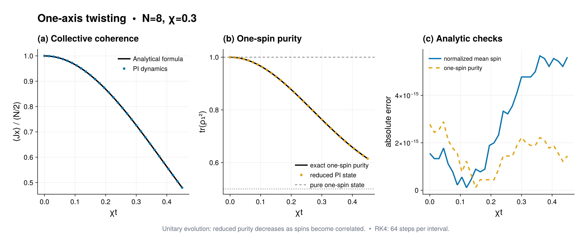

# One-axis twisting

Source: [`one_axis_twisting.jl`](one_axis_twisting.jl)

## Model

For `N = 8` spins initially polarized along `+x`, the one-axis-twisting
Hamiltonian is

```math
H=\chi J_z^2.
```

It is collective and conserves total spin, so evolution remains in the fully
symmetric sector. A standard analytic benchmark is

```math
\langle J_x(t)\rangle=\frac N2[\cos(\chi t)]^{N-1}.
```

## Solution

Construct the collective quadratic Hamiltonian, prepare its matrix-free
generator once, and propagate the `+x` product state with the high-level
fixed-step solver:

```julia
prepared = compile(model; backend=:matrixfree)
solution = solve_dynamics(prepared, rho0, (first(times), last(times));
                          saveat=times, steps_per_interval=64)
```

The script builds one `OneBodyGeometry`, prepares `Jx` as a
`CollectiveObservablePlan`, and reuses its Schur blocks at every requested
time. It reports the maximum discrepancy from the exact mean spin. State
diagnostics validate the final trace, Hermiticity, and positivity without
modifying the propagated state.

The time-resolved one-particle purity demonstrates the analogous
fixed-bipartition workflow:

```julia
one_body = ReductionPlan(b, 1)
p1 = [reduced_purity(rho, 1; plan=one_body) for rho in solution]
```

For a state or parameter scan, the setup of both plans is paid once. A qudit
`ReductionPlan` can retain many dense Littlewood--Richardson intertwiners, so
it should be kept only when the same `(basis,k)` reduction is repeated.

## Makie figure

The optional three-panel Makie figure compares the normalized PI mean spin with
the analytical curve from the cited work and shows the one-spin purity evaluated
from the same saved states. For this initial state and Hamiltonian, the exact
one-spin purity is

```math
\mathrm{tr}(\rho_1^2)=\frac{1+[\cos(\chi t)]^{2(N-1)}}{2}.
```

The purity panel now compares both routes and shows the physical interval
from a maximally mixed qubit (`1/2`) to a pure qubit (`1`). The third panel
shows unmodified absolute errors in the normalized mean spin and purity on a
linear scale. The script asserts that both the unnormalized spin error and
the purity error are below `1e-9`. The loss of one-spin purity visualizes the
correlations generated by one-axis twisting without reconstructing a
`2^N`-dimensional state. PDF and PNG copies are written as
`one_axis_twisting.*`. The `.tsv` companion contains both observables, their
exact references, raw errors, and the run parameters.

## Run

```sh
julia --project=examples examples/one_axis_twisting.jl
```

This benchmark tests coherent nonlinear dynamics independently of dissipative
terms. Spin squeezing can be obtained from the library's collective moments
and covariance functions using the same geometry or prepared spin plans.
Increase `steps_per_interval` to check fixed-step convergence after changing
the Hamiltonian strength or sampling grid. Without CairoMakie, the numerical
benchmark and reduced-state calculation still run and only plotting is
skipped.

## Expected output



The numerical markers use the default fixed-step controls and are compared
with the analytical collective-spin curve.
