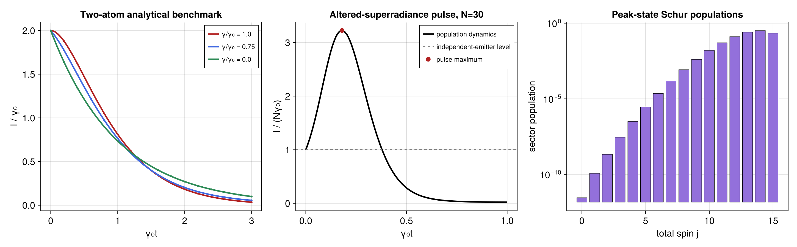
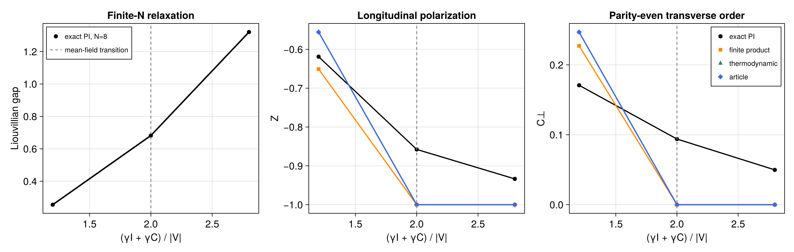
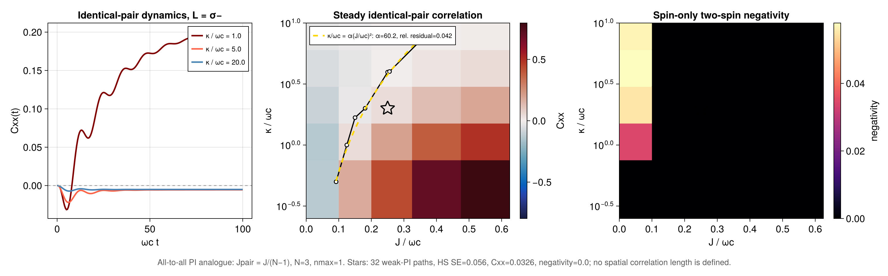

# Reusable literature-model constructors

Source: [`paper_models.jl`](paper_models.jl)

This file is a helper module used to keep paper-specific normalizations and
spin conventions in one place. It provides constructors for the Damanet (2016),
Pausch (2024), Kitagawa-Ueda, Huelga, Shammah, Morrison, Meiser, Iemini,
Piccitto, Nakanishi--Sasamoto, Zhang--Mølmer, and Debecker spin--pseudomode
models, together with the package's public `spin_matrices` convention. The
Nakanishi--Sasamoto helper also returns the exact balanced-gain/loss
Liouvillian spectrum used as a finite-size regression oracle.

## Use

```julia
using PermutationalInvariantDynamics
include("examples/paper_models.jl")
using .PaperModels

model = PaperModels.one_axis_twisting_model(8; chi=0.2)
prepared = compile(model)
```

Each constructor returns a `PIModel` containing its basis and immutable term
tuple. Compile it once, then pass the resulting `CompiledPIModel` to
`solve_dynamics`, `stationary_state`, or `liouvillian_spectrum`. Use
`CollectiveObservablePlan` when the same collective one-particle observable is
evaluated repeatedly. The individual example scripts show complete workflows
for each family and retain explicit matrix exponentiation only where that is
the independent small-system validation method.

## Why use the constructors?

Literature comparisons are sensitive to whether spin operators are Pauli
matrices or Pauli matrices divided by two, and to the definition of
`D[L]`. These constructors encode the convention used by the accompanying
benchmarks. When changing parameters, preserve the documented `N` scaling of
collective rates.

`collective_local_decay_model` returns the decay-only specialization of
Zhang, Zhang, and Mølmer's collective-plus-local master equation.
`collective_local_radiation_operators` constructs its cavity and free-space fluxes,
``\Gamma_cJ_+J_-`` and ``\gamma_l\sum_i\sigma_+^{(i)}\sigma_-^{(i)}``.
These helpers are used by the trajectory/master-equation comparison without
introducing a plotting or cavity-mode dependency.

The time-crystal constructors make two easily missed convention conversions
explicit. `balanced_gain_loss_time_crystal_model` converts the paper's dissipator
`D_paper = 2D_std` to the package convention. The normalized magnetizations
in `interacting_boundary_time_crystal_model` give collective jump rates `4Gamma/N`,
and its `Jz^2` interaction is lowered to a two-body term after removing the
irrelevant identity component.

`dissipative_collective_spin_pairing_model` likewise retains the microscopic provenance of its LMG
Hamiltonian: the self part of `Jx^2 - Jy^2` is a `LocalHamiltonian`, and the
cross part is a symmetric `PBodyHamiltonian` with its required factor of two.
This is exactly equivalent to the collective quadratic operator in the paper,
but also allows the returned model to be passed directly to `MeanFieldPlan`
for finite-product or thermodynamic predictions.

## Uniform all-pair spin--pseudomode embedding

`local_pseudomode_operators(nmax; T=Float64)` constructs one truncated
spin--mode supersite in the fixed order `spin tensor mode`. It returns the
spin Pauli matrices, their supersite lifts, the mode annihilation, number, and
top-level projectors, and the exchange matrices for either `sigma_minus` or
`sigma_z` coupling. Its local dimension is `2(nmax+1)`.

`all_to_all_xx_spin_local_pseudomode_model` then constructs the exact PI
uniform-all-pair specialization of the local-pseudomode embedding in the
maintainer-supplied Debecker *et al.* manuscript:

```julia
operators = local_pseudomode_operators(2)
basis = PIBasis(N, operators.dsite)
model = all_to_all_xx_spin_local_pseudomode_model(
    basis, operators;
    Jpair=J / (N - 1),
    omega_c=1.0,
    gamma=0.05,
    kappa=2.0,
    coupling=:minus,
)
```

The Hamiltonian represented by this call is

```math
H=-J_{\mathrm{pair}}\sum_{i<j}X_iX_j
  +\omega_c\sum_i a_i^\dagger a_i
  +\sqrt{\gamma\kappa}\sum_i
   \left(L_i a_i^\dagger+L_i^\dagger a_i\right).
```

`Jpair` is the literal coefficient of each unordered pair; the helper never
inserts a Kac factor. The example above explicitly chooses
`Jpair=J/(N-1)`. The mode-loss term has package rate `2kappa` because the
manuscript uses `D_paper=2D_package`. `coupling` accepts `:minus` and `:z`.

This helper is not a constructor for the manuscript's nearest-neighbour
ring. That geometry is only translation invariant, whereas the helper assumes
invariance under every site permutation. Consequently the all-pair model has
one common distinct-pair correlator and no spatial correlation length. See
[`all_to_all_xx_spin_local_pseudomodes.md`](all_to_all_xx_spin_local_pseudomodes.md)
for the complete dynamics, stationary-state, spin-only-negativity, and cutoff
workflow.

The basis-taking method is preferred for parameter scans because it reuses the
same complete `PIBasis`. The convenience method
`all_to_all_xx_spin_local_pseudomode_model(N,nmax; ...)` constructs that
basis automatically. A complete basis has
`binomial(N + d^2 - 1, N)` PI coordinates with
`d=2(nmax+1)`, so the pseudomode cutoff must be convergence-tested and its
rapid coordinate growth estimated before large scans.

## Expected output

`paper_models.jl` is a constructor module and intentionally performs no solve
when included. Its constructors feed the checked workflows illustrated below:







Run the linked model-specific scripts to reproduce a figure; including this
helper alone only defines the constructors.
