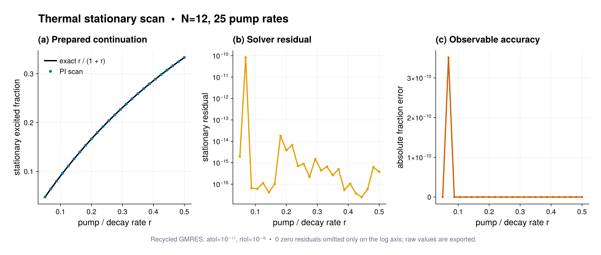

# Prepared steady-state parameter scan

Source: [`parameter_scan.jl`](parameter_scan.jl)

## Model

The example considers 12 qubits coupled independently to an emitting and a
pumping reservoir,

```math
\mathcal L\rho=\sum_i\mathcal D[\sigma_i^-]\rho
 +r\sum_i\mathcal D[\sigma_i^+]\rho.
```

The exact stationary excited-state fraction is ``r/(1+r)``. This gives a
compact validation of both the stationary solver and continuation machinery.

## Prepared scan

Only the two scalar jump rates vary, so the script first calls
`compile_family` on one prototype model. `ParameterScanPlan` then binds
`(1.0, pump)` through `rate_builder` at each point:

```julia
family = compile_family(thermal_model(first(pump_rates)))
plan = ParameterScanPlan(pump_rates, family;
    rate_builder=pump -> (1.0, pump),
    algorithm=RecycledGMRESAlgorithm(
        krylovdim=24, recycle_dim=6),
    continuation=true)
```

The immutable Schur geometry is prepared once. Every specialization owns the
correct numerical rates, while the serial scan reuses its matrix-free
application workspace, GMRES storage, and a bounded revalidated GCRO recycle
space. The preceding steady state is also used as the next initial iterate.
Use the ordinary model-builder constructor instead when an operator, body
order, basis, or other non-scalar geometry changes.

The example sets `save_outputs=false`. The streaming callback still sees each
new `PIState`, extracts the excitation fraction, and then lets the state be
released. Only scalar point metadata and one final restart seed remain in the
result. This prevents saved-state memory from growing as
`number of points * PI dimension`.

The first call intentionally stops after three points with `max_points=3`.
`resume_parameter_scan` validates the complete parameter grid and resumes from
the retained seed in a fresh `ParameterScanWorkspace`. No model builder,
callback, random generator, compiled plan, or Krylov workspace is embedded in
the checkpoint-neutral result.

The final `parameter_scan_columns` call provides dependency-free column data
for plotting or tabular analysis. The script checks the exact thermal
prediction and asserts that no state history was retained.

## Batched dynamic sensitivity

The last setup-only check prepares the augmented equation for
``[\rho,\partial\rho/\partial r]``:

```julia
dynamic_model = specialize(family, (1.0, first(pump_rates)))
rho_dynamic = iid_pure_state(basis, ComplexF64[1, 0])
dL = compile(
    PIModel(basis, (LocalJump(sp; rate=1.0),));
    backend=:matrixfree)
problem = sensitivity_problem(
    dynamic_model, rho_dynamic, (0.0, 0.1), (dL,))
```

`sensitivity_problem` applies the prepared physical generator to the state
and tangent columns in one genuine matrix-RHS call. Static derivative
generators receive their own task-owned workspaces. The example evaluates
this in-place right-hand side once, compares both columns with separate
prepared applications, and introduces no ODE solver dependency.

## Expected output



The left panel compares the streamed PI stationary values with the exact
thermal fraction $r/(1+r)$; the right panel shows the residual returned at
each continuation point. The plot reuses the callback records and does not
retain or recompute stationary states. It is a default-grid illustration:
the pointwise solver assertions and exact curve are the quantitative checks.

## Run

```sh
julia --project=. examples/parameter_scan.jl
```

For independent scans set `continuation=false` and use
`execution=:threads`. After `using Distributed` and adding workers, the
optional extension provides

```julia
distributed_parameter_scan(independent_plan)
```

for deterministic balanced chunks. Alternatively, a scheduler can assign
disjoint `indices` manually and combine returned objects with
`merge_parameter_scan_results`; per-index random seeds make spectral chunks
independent of scheduling. Distributed continuation is deliberately rejected,
and worker chunks complete before master-side stopping policies are applied.
