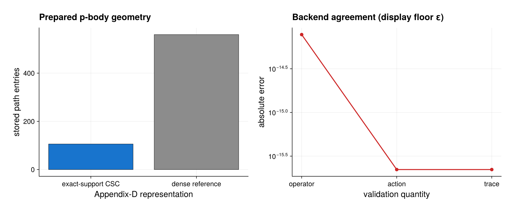

# Permutation-invariant pair processes

Source: [`pbody_pair_processes.jl`](pbody_pair_processes.jl)

## Model

For `N = 6`, the example combines a two-body Ising interaction, local pair
loss, and collective pair loss. Representative terms are

```math
\sum_{i<j}\sigma_i^z\sigma_j^z
=\frac{J_z^2-NI}{2},\qquad
L_{ij}=\sigma_i^-\sigma_j^- .
```

The precise factor in the collective identity follows the `Jz` convention in
the source.

## Solution

Use `PBodyHamiltonian` for the two-site Hamiltonian kernel,
`LocalPBodyJump` for the sum over distinct local pairs, and
`CollectivePBodyJump` for the coherent sum of pair amplitudes. These terms
implement the Appendix-D combinatorics directly in PI space.

The explicit operator check prepares one reusable geometry:

```julia
geometry = PBodyGeometry(basis, 2)
pair_sum = pbody_collective_operator(
    basis, pair_interaction, 2; cache=geometry)
```

Every removal-path isometry is retained as an exact-support sparse CSC map,
not as its zero-heavy three-index dense equivalent. The script prints
`geometry.estimates.retained_entries` beside `dense_entries` and verifies
that the packed representation is smaller. Model compilation applies the
same selection rules automatically; pass an explicit cache when constructing
several standalone p-body operators with the same basis and body order.

The model is first lowered with

```julia
prepared = compile(model; backend=:matrixfree)
workspace = LiouvillianWorkspace(prepared)
```

The explicit workspace makes repeated `apply!` calls reuse all matrix-free
scratch storage. This example intentionally accesses solver internals because
its purpose is backend validation: it assembles a sparse Liouvillian from the
same compiled plan, applies both backends to the initially excited `PIState`,
and compares their coordinate derivatives. It also wraps the derivative in a
typed `PIState` to evaluate its physical trace functional.

`diagnostics(prepared)` reports the selected backend and retained heap size.
The assertions require the pair-sum identity, backend action, and trace
derivative errors all to be below `1e-10`.

## Expected output



The left panel compares the exact-support sparse path entries retained by
`PBodyGeometry` with the zero-heavy dense-reference entry count. It is a
structural storage count, not a measured memory or timing benchmark. The right
panel shows the pair-operator identity error, sparse/matrix-free action
difference, and trace-derivative error. Exact zeros are displayed at machine
epsilon on the logarithmic axis without changing the values used by the
assertions.

## Run

```sh
julia --project=. examples/pbody_pair_processes.jl
```

Use the examples environment from [`README.md`](README.md) to generate the
optional PDF and PNG figure. Running under the root environment executes all
backend checks and skips only plotting.

Agreement of the two actions tests the optimized Appendix-D kernel without
relying on a particular time integrator. Production dynamics normally pass
the compiled model directly to `solve_dynamics`; explicit sparse assembly is
used here only as a small-system reference.
