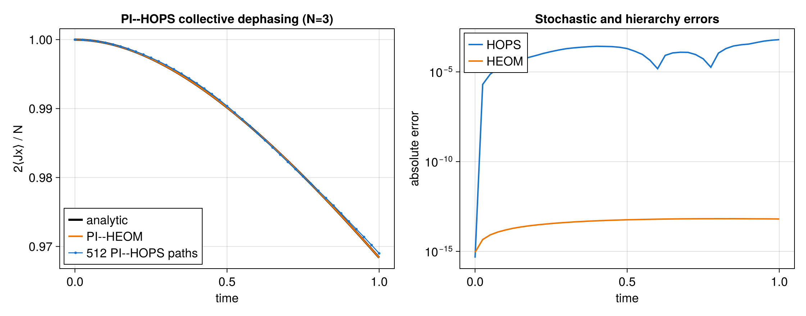

# PI--HOPS collective dephasing

This example applies the linear hierarchy of pure states to three identical
qubits coupled to one shared, exponentially correlated dephasing bath. It
compares three calculations:

- the stochastic PI--HOPS ensemble;
- deterministic PI--HEOM with the same bath correlation;
- the analytic collective-dephasing coherence.

The executable script is [`pi_hops.jl`](pi_hops.jl).

## Model

The bath couples through the collective PI operator

```math
L=J_z,\qquad
C(t)=c e^{-\nu t},
```

with \(c=0.10\) and \(\nu=1.50\). The system Hamiltonian is zero and the
initial state is \(|+x\rangle^{\otimes N}\), with \(N=3\). For this commuting,
real-correlation problem,

```math
\frac{2\langle J_x(t)\rangle}{N}
=\exp[-g(t)],\qquad
g(t)=\frac{c}{\nu^2}
 \left(\nu t-1+e^{-\nu t}\right).
```

This analytic signal tests both non-Markovian memory and the normalization
convention without constructing a full \(2^N\) density matrix.

## HOPS calculation

The PI state is rank one in its occupied Schur sector, so it has an exact
weak-PI pseudo-ket representation:

```julia
basis = PIBasis(N, 2)
spin = spin_matrices()
Jz = collective_operator(basis, spin.jz)
H = PIOperator(basis; T=Float64)

rho0 = iid_pure_state(basis, ComplexF64[1, 1] / sqrt(2))
psi0 = weak_pi_pseudoket(rho0)

bath = HOPSBath(Jz, coefficient, frequency)
plan = HOPSPlan(H, bath; max_depth=4, scaling=:scaled)
```

A single path is generated with task-owned scratch:

```julia
workspace = HOPSWorkspace(plan)
path = hops_trajectory(
    plan, psi0, times;
    dt=0.005, rng=Random.Xoshiro(2026), workspace)
rho_path = hops_density(path, lastindex(times))
```

Linear HOPS trajectories are unnormalized. Consequently,
`trace(rho_path)` generally differs from one. Renormalizing this projector
would bias the linear estimator.

The physical estimate is an average of root outer products:

```julia
hops_states = hops_average(
    plan, psi0, times, 512;
    dt=0.005, seed=12026, threaded=false)
```

The example uses a serial ensemble for an exactly reproducible reference.
Independent paths can be threaded in production. Statistical error decreases
only as the number of independent samples grows; threading changes elapsed
time, not the estimator.

## HEOM comparison

The deterministic reference uses the same \(J_z\), \(c\), and \(\nu\):

```julia
system = PIModel(basis, ())
heom_bath = HEOMBath(Jz, coefficient, frequency)
heom_plan = HEOMPlan(
    system, heom_bath; max_depth=6, scaling=:scaled)
heom_states = [
    heom_reduced_state(state) for state in
    heom_time_evolution(
        heom_plan, rho0, times; steps_per_interval=8)
]
```

The HEOM depth is intentionally higher than the HOPS depth. A finite HOPS
ensemble and a finite HEOM hierarchy need not agree term by term; both must
be converged toward the same reduced dynamics. The script checks that HEOM
agrees tightly with the analytic signal and that the finite HOPS mean falls
within a deliberately loose Monte Carlo validation bound.

## Figure

With CairoMakie available, the script writes `pi_hops.{pdf,png}`. The first
panel overlays the analytical coherence, deterministic PI--HEOM result, and
PI--HOPS ensemble mean. The second panel shows the pointwise HOPS and HEOM
errors relative to the analytical curve. Plotting reuses the arrays that pass
the numerical assertions and does not trigger another solve.

## What to converge

For a publishable result, repeat the calculation while changing one control
at a time:

1. halve `dt`;
2. increase `max_depth`;
3. increase the trajectory count and report standard errors;
4. extend the exponential bath representation when it approximates a
   non-exponential target correlation.

The built-in noise generator used here is efficient because the coefficient
is real and positive: it uses an exact stationary complex
Ornstein--Uhlenbeck recursion on the integration grid. Complex-coefficient
decompositions require an externally prepared noise with the covariance of
the *total* correlation. See
[the PI--HOPS guide](../docs/src/hops.md) before importing a finite-temperature
or fitted decomposition.

Most importantly, the example describes one common bath. Independent local
colored noises break permutation symmetry on each stochastic realization and
cannot be propagated exactly as weak-PI pseudo-kets. Use PI--HEOM or local
pseudomode supersites for that setting.

## Running

From the package root:

```bash
julia --project=. examples/pi_hops.jl
```

The derivation and nonlinear importance-sampled extension originate with
D. Süß, A. Eisfeld, and W. T. Strunz,
[*Phys. Rev. Lett.* **113**, 150403 (2014)](https://doi.org/10.1103/PhysRevLett.113.150403).
Practical convergence and
colored-noise generation are discussed by R. Hartmann and W. T. Strunz,
[*J. Chem. Theory Comput.* **13**, 5834 (2017)](https://doi.org/10.1021/acs.jctc.7b00751).

## Expected output



The stochastic curve uses the script's fixed seed and default path count.
Monte Carlo, time-step, and hierarchy errors must be converged separately.
