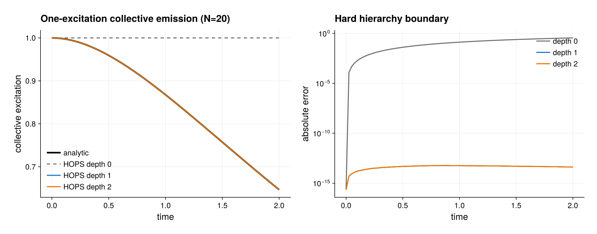

# PI--HOPS collective emission

Source: [`pi_hops_collective_emission.jl`](pi_hops_collective_emission.jl)

This example demonstrates three HOPS features not exercised by the basic
collective-dephasing example:

- a non-Hermitian shared-bath coupling $L=J_-$;
- an exact hierarchy-depth check in a one-excitation manifold;
- deterministic external noise and direct conditioned application through
  `hops_rhs!`.

It uses only symmetric Schur coordinates and never constructs a $2^N$ ket or
density matrix.

## Model and exact solution

The ensemble starts in the symmetric one-excitation Dicke state

```math
|W_N\rangle=|j=N/2,m=1-N/2\rangle
```

and couples to one zero-temperature structured bath through

```math
L=J_-,
\qquad
C(t)=c e^{-\nu t}.
```

For the script, $N=20$, $c=0.01$, and $\nu=1.20$. Collective operators
preserve total spin, so the restricted basis

```julia
basis = PIBasis(N, 2; sectors=[(N, 0)])
```

is exact for this model.

Within the zero- and one-excitation subspace, the survival amplitude obeys

```math
\ddot G(t)+\nu\dot G(t)+NcG(t)=0,
\qquad
G(0)=1,\quad \dot G(0)=0.
```

Writing $\delta=\sqrt{\nu^2-4Nc}$, its solution is

```math
G(t)=e^{-\nu t/2}
\left[
\cosh\left(\frac{\delta t}{2}\right)
+\frac{\nu}{\delta}\sinh\left(\frac{\delta t}{2}\right)
\right].
```

The line break above is only typographical: the leading $e^{-\nu t/2}$
multiplies the complete bracket. With
$N_e=\sum_i |e_i\rangle\langle e_i|$, the collective excitation is
$\langle N_e(t)\rangle=|G(t)|^2$.

## Why depth one is exact here

The root contains the symmetric one-excitation state. Applying $J_-$ maps it
to the collective ground state, and applying $J_-$ again gives zero.
Consequently no hierarchy node above occupation one can feed the physical
amplitude. The script compares hard boundaries at depths 0, 1, and 2:

```julia
plans = [
    HOPSPlan(H, bath; max_depth=depth, scaling=:scaled)
    for depth in (0, 1, 2)
]
```

Depth zero deliberately misses the memory feedback. Depths one and two agree
with the analytical survival law up to the fixed-step RK4 error. This exact
closure is special to the selected initial manifold; it is not a general HOPS
depth prescription.

## Non-Hermitian coupling and ensemble estimate

`HOPSBath` accepts a fixed non-Hermitian PI coupling:

```julia
Jminus = collective_operator(basis, spin_matrices().jm)
bath = HOPSBath(
    Jminus, coefficient, frequency; label=:lorentzian_emission)
plan = HOPSPlan(H, bath; max_depth=1, scaling=:scaled)
```

A built-in stationary Ornstein--Uhlenbeck path contains a stochastic ground
amplitude. The one-excitation amplitude, however, is deterministic in this
manifold, so even the small eight-path average reproduces $|G(t)|^2$.
Individual linear-HOPS roots remain unnormalized. The script verifies

```julia
trace(hops_density(path, index)) == norm(path.states[index].data)^2
```

instead of normalizing a root.

## External noise and `hops_rhs!`

An external provider can condition a single path:

```julia
zero_noise = (_time::Real, _bath::Integer) -> 0.0 + 0.0im
path = hops_trajectory(
    plan, psi0, times;
    dt=0.0025, noise=zero_noise, workspace=HOPSWorkspace(plan))
```

The zero function is a useful deterministic diagnostic, but it does **not**
have the stated bath covariance and must not be averaged as though it were a
physical stochastic ensemble. A physical external provider must be prepared
before propagation and reproduce the covariance of the complete correlation.

The lowest-level conditioned action is also shown:

```julia
source = zeros(ComplexF64, size(plan, 1))
source[1:weak_pi_dimension(basis)] .= psi0.data
destination = similar(source)
hops_rhs!(
    destination, plan, source, ComplexF64[0], HOPSWorkspace(plan))
```

`source` and `destination` must not alias. Repeated calls with the same source
and already prepared noise are deterministic and consume no random numbers.

## Hierarchy inspection and figure

The example reports:

- `hops_hierarchy_metadata(plan)`;
- `hops_multiindices(plan)`;
- `hops_auxiliary_importances(plan)`;
- `hops_coordinate_scale(plan, [1])`.

The importance is a diagnostic score, not an error estimate. The coordinate
scale describes the exact scaled/unscaled similarity transform and is not a
physical approximation.

With CairoMakie available, the script saves
`pi_hops_collective_emission.{pdf,png}`. The left panel compares the
collective excitation with the analytical curve; the right panel exposes the
hard-boundary error at each hierarchy depth.

Run from the repository root:

```sh
julia --project=. examples/pi_hops_collective_emission.jl
```

For plotting, use the examples environment described in
[`README.md`](README.md).

Linear HOPS and its hierarchy construction are described by D. Süß,
A. Eisfeld, and W. T. Strunz,
[*Phys. Rev. Lett.* **113**, 150403 (2014)](https://doi.org/10.1103/PhysRevLett.113.150403).

## Expected output



For this one-excitation initial manifold, depths one and two close exactly up
to integration error; that closure is not a general hierarchy-depth rule.
