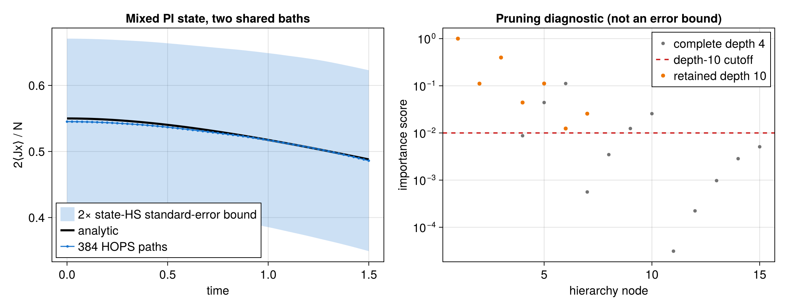

# Mixed-state, multi-bath PI--HOPS

Source: [`pi_hops_mixed_multibath.jl`](pi_hops_mixed_multibath.jl)

This example shows how to:

- start linear HOPS from a general mixed PI density operator;
- combine two independent shared Gaussian baths;
- reuse `HOPSBatchWorkspace`;
- request `HOPSEnsembleResult` Monte Carlo diagnostics;
- inspect complete and importance-pruned hierarchy metadata.

The analytical collective-dephasing signal provides an independent numerical
check.

## Mixed PI initial state

Each qubit starts in

```math
\rho_\mathrm{loc}
=\frac12
\begin{pmatrix}
1&r\\
r&1
\end{pmatrix},
\qquad r=0.55,
```

and the complete initial state is
$\rho(0)=\rho_\mathrm{loc}^{\otimes N}$ with $N=3$. Although it is a
tensor product, it is mixed and generally occupies multiple Schur sectors.
The library constructs it directly in PI coordinates:

```julia
rho0 = iid_state(basis, local_density)
initial = hops_initial_ensemble(plan, rho0)
```

`hops_initial_ensemble` diagonalizes each multiplicity-weighted Schur block.
Its positive eigenvalues form a categorical distribution over normalized
Schur-irrep roots. It does not sample multiplicity tableaux, clip negative
eigenvalues, or construct a $2^N$ state. Passing `rho0` directly to
`hops_average` invokes the same preparation automatically.

## Two shared baths

The two statistically independent baths both couple through the collective
operator $J_z$:

```math
C_b(t)=c_b e^{-\nu_b t},
\qquad b\in\{\mathrm{slow},\mathrm{fast}\}.
```

They are prepared separately and retain their physical labels:

```julia
slow_bath = HOPSBath(
    Jz, cslow, nuslow; label=:slow_bath)
fast_bath = HOPSBath(
    Jz, cfast, nufast; label=:fast_bath)
plan = HOPSPlan(
    H, (slow_bath, fast_bath);
    max_depth=4, scaling=:scaled)
```

Every realization remains PI because each bath noise multiplies one PI
collective operator. This is not a model of independent local noises
$z_i(t)$, which break permutation symmetry on individual paths.

For commuting collective dephasing, the normalized transverse signal is

```math
\frac{2\langle J_x(t)\rangle}{N}
=r\exp[-g(t)],
```

with

```math
g(t)=\sum_b\frac{c_b}{\nu_b^2}
\left(\nu_b t-1+e^{-\nu_b t}\right).
```

The script compares this expression with the HOPS ensemble at every saved
time.

## Reusable batch workflow

A batch workspace owns one mutable hierarchy and random-number generator per
worker:

```julia
workers = min(Threads.nthreads(), 4)
batch = HOPSBatchWorkspace(plan; workers)
result = hops_average(
    plan, initial, times, 384;
    dt=0.01, seed=2026,
    threaded=workers > 1,
    workspace=batch, return_info=true)
```

The immutable `HOPSPlan` is shared; `HOPSBatchWorkspace` must not serve two
simultaneous ensemble calls. Seeds are assigned to trajectory indices, while
the final floating reduction can differ by roundoff when the worker count
changes.

`result.states` are averages of the **unnormalized** root outer products.
`result.standard_error` is a Hilbert--Schmidt state standard error. The
example contracts it with the coefficient-space norm of $2J_x/N$ to obtain
a conservative Cauchy--Schwarz observable bound. It describes Monte Carlo
dispersion only; it does not include hierarchy, time-step, correlation-fit, or
initial-model error.

## Hierarchy metadata and importance pruning

The complete two-pole hierarchy at depth $D=4$ has

```math
\binom{2+D}{D}=15
```

pure-state nodes. The script inspects it with

```julia
metadata = hops_hierarchy_metadata(plan)
labels = hops_multiindices(plan)
scores = hops_auxiliary_importances(plan)
scales = [
    hops_coordinate_scale(plan, index)
    for index in eachindex(labels)
]
```

It also prepares, but deliberately does not evolve, a depth-10 hierarchy with
`importance_cutoff=0.01`. A positive cutoff retains a deterministic
downward-closed subset. The score is only a setup heuristic and is not an
accuracy bound. A production calculation must reduce the cutoff and increase
the hard depth independently.

## Figure and convergence

With CairoMakie available, the script writes
`pi_hops_mixed_multibath.{pdf,png}`:

- the analytical and stochastic transverse signals, with a conservative
  two-standard-error state-norm band;
- complete and retained auxiliary importance scores with the explicit cutoff.

For a research calculation, vary at least:

1. `dt`;
2. `max_depth`;
3. `importance_cutoff`, if nonzero;
4. the bath exponential representation;
5. the number of independent paths.

Run without plotting from the package environment:

```sh
julia --project=. examples/pi_hops_mixed_multibath.jl
```

Use the examples environment from [`README.md`](README.md) to generate the
Makie files.

The linear hierarchy and its unnormalized estimator follow D. Süß,
A. Eisfeld, and W. T. Strunz,
[*Phys. Rev. Lett.* **113**, 150403 (2014)](https://doi.org/10.1103/PhysRevLett.113.150403).

## Expected output



The stochastic panel uses the documented seed and default ensemble. Importance
scores are diagnostics, not truncation-error bounds.
