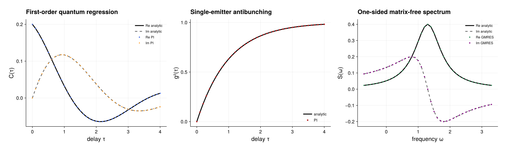

# Quantum regression, antibunching, and optical spectra

Source: [`quantum_regression.jl`](quantum_regression.jl)

## Model

A single two-level emitter of transition frequency $\omega_0$ undergoes
incoherent pumping at rate $\gamma_\uparrow$ and emission at rate
$\gamma_\downarrow$:

```math
\mathcal L\rho=-i[\omega_0 j_z,\rho]
+\gamma_\downarrow\mathcal D[j_-]\rho
+\gamma_\uparrow\mathcal D[j_+]\rho.
```

Writing $\Gamma=\gamma_\uparrow+\gamma_\downarrow$, its stationary excited
population is

```math
p_e=\frac{\gamma_\uparrow}{\Gamma}.
```

The example uses $\omega_0=1.3$, $\gamma_\downarrow=0.8$, and
$\gamma_\uparrow=0.2$.

## Time-domain quantum regression

The optical correlation follows the explicit convention

```math
C(\tau)=\mathrm{tr}\!\left[
j_+ e^{\mathcal L\tau}(j_-\rho_{\rm ss})\right].
```

Because `expectation(rho, A)` in the package means
`tr(A' * rho)`, `CorrelationPlan` deliberately performs the QRT readout as
`tr(A * propagated)` without adding another adjoint. The operators are
therefore passed as

```julia
plan = CorrelationPlan(prepared, adjoint(c), c)
workspace = CorrelationWorkspace(plan; krylovdim=8)
correlation = two_time_correlation(
    plan, rho_ss, delays; workspace=workspace)
```

For this model,

```math
C(\tau)=p_e e^{(-\Gamma/2+i\omega_0)\tau}.
```

The Schur representation is exact. The time propagation in this example is a
fixed-step RK4 approximation, so the step count should be convergence-tested
for a new model.

## Delayed second-order correlation

`delayed_second_order_correlation` evaluates

```math
G^{(2)}(\tau)=\mathrm{tr}\!\left[
j_+j_- e^{\mathcal L\tau}(j_-\rho_{\rm ss}j_+)\right]
```

and divides by the squared stationary intensity. It verifies that the input
state is stationary and rejects normalization at zero intensity. A single
two-level emitter gives the antibunching law

```math
g^{(2)}(\tau)=1-e^{-\Gamma\tau},\qquad g^{(2)}(0)=0.
```

Use `normalized=false` when an unnormalized, possibly nonstationary
$G^{(2)}$ is the intended quantity.

## Matrix-free optical spectrum

`optical_spectrum` computes the connected one-sided transform

```math
S(\omega)=\int_0^\infty
e^{-i\omega\tau}C_{\rm conn}(\tau)\,d\tau
```

by shifted GMRES. It reuses the caller-owned correlation workspace and applies
the compiled Liouvillian directly; it does not build a dense or sparse
Liouvillian matrix. Here the analytical answer is

```math
S(\omega)=\frac{p_e}{\Gamma/2+i(\omega-\omega_0)}.
```

The returned values are complex one-sided transforms. No factor of two and no
real-part projection is applied. For conventions where the corresponding
two-sided Hermitian spectrum is required, form `2real.(spectrum.values)`.
The disconnected stationary component would be a Dirac delta and is therefore
not silently regularized by the resolvent API.

The example also calls `correlation_spectrum_fft`. That routine applies an
in-place radix-two FFT to uniformly sampled QRT data with trapezoidal endpoint
weights and zero padding. It represents a finite observation window, not the
infinite-time resolvent, and subtracts the analytically known stationary
offset rather than estimating it from the last sample.

## Expected output



The left panel compares the real and imaginary parts of the sampled
first-order correlation with the analytical damped oscillation. The middle
panel shows the normalized antibunching curve, including ``g^{(2)}(0)=0``.
The right panel compares both components of the complex one-sided
matrix-free resolvent spectrum with the analytical expression; it is not
silently converted to a two-sided real spectrum. The preview uses the default
rates, delay and frequency grids, RK4 resolution, and GMRES tolerances.
Converge the time propagation and every shifted solve independently for a new
model, and separately check the finite-window FFT if that approximation is
used.

## Run

```sh
julia --project=. examples/quantum_regression.jl
```

The script checks the time correlation, antibunching curve, and resolvent
spectrum against the analytical formulas above.

Use the examples environment described in [`README.md`](README.md) to write
the optional PDF and PNG. The root package environment runs all numerical
assertions and skips only CairoMakie rendering.
