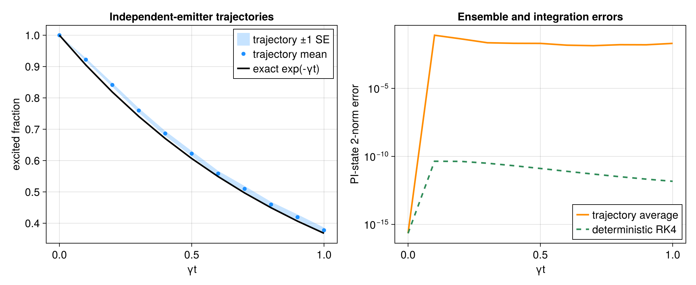

# Quantum trajectories: an analytic Mølmer benchmark

Source: [`quantum_trajectories.jl`](quantum_trajectories.jl)

## Model and literature connection

This example tests the PI quantum-jump implementation in the foundational
Monte Carlo wave-function setting introduced by Dalibard, Castin, and Mølmer,
[*Phys. Rev. Lett.* **68**, 580 (1992)](https://doi.org/10.1103/PhysRevLett.68.580),
and developed by Mølmer, Castin, and Dalibard,
[*J. Opt. Soc. Am. B* **10**, 524 (1993)](https://doi.org/10.1364/JOSAB.10.000524).
Six initially excited qubits decay independently:

```math
\dot\rho=\gamma\sum_{i=1}^N\mathcal D[\sigma_-^{(i)}]\rho,
\qquad
\mathcal D[L]\rho=L\rho L^\dagger-\tfrac12\{L^\dagger L,\rho\}.
```

The model has unusually strong analytical checks. With
``p_e(t)=e^{-\gamma t}``, its exact state is

```math
\rho(t)=\left[(1-p_e)|g\rangle\langle g|
                 +p_e|e\rangle\langle e|\right]^{\otimes N}.
```

The excitation count is ``B(N,p_e)``. At the final time the photon count is
``B(N,1-p_e)``, with mean ``N(1-p_e)``, variance
``Np_e(1-p_e)``, and no-jump probability ``e^{-N\gamma t}``.

## PI solution and comparisons

The script draws 500 event-driven paths using continuous hazard roots. It
compares them with both the exact tensor-power PI state and deterministic
matrix-free evolution prepared once by `compile`. No ``2^N`` vector or
``2^N\times2^N`` matrix is constructed.

`trajectory_statistics` computes the excitation mean and its sampling error.
The script checks the mean at every saved time against the exact binomial law
in units of its analytical standard error. It separately checks the final
sample mean photon count and the rare no-jump fraction, and prints the sample
and exact count variances. A six-standard-error gate is deliberately used for
the stochastic comparisons; numerical convergence and Monte Carlo sampling
error are different uncertainties.

```julia
prepared = compile(model; backend=:matrixfree)
trajectory_plan = TrajectoryPlan(prepared)
trajectory_batch = TrajectoryBatchWorkspace(trajectory_plan, rho0)
trajectories = quantum_trajectories(
    trajectory_plan, rho0, times, 500;
    algorithm=:event, dt=0.1, dtmax=0.2,
    abstol=1e-10, reltol=1e-8,
    event_time_tolerance=1e-9, seed=2025,
    threaded=Threads.nthreads() > 1,
    workspace=trajectory_batch,
)
```

The prepared trajectory plan is immutable and shared by every path. Each
batch worker owns its Runge--Kutta buffers and RNG; small dynamically claimed
chunks amortize scheduling overhead, while per-trajectory seeds make the
ordered result reproducible in serial and threaded runs. Reusing
`trajectory_batch` avoids rebuilding either the Schur geometry or worker
scratch in a parameter-independent repeated ensemble.

For a batch that will use only the fixed-step algorithm, select the lean
workspace explicitly:

```julia
fixed_batch = TrajectoryBatchWorkspace(
    trajectory_plan, rho0; mode=:fixed)
```

Fixed propagation then uses only three full-vector RK4 registers and omits
`k3`, `k4`, plus six adaptive Dormand--Prince/event-root vectors per worker.
The default `mode=:full` used above is required by `algorithm=:event`; passing
a fixed-only workspace to that algorithm raises instead of allocating hidden
scratch.

At each stage, the rate-weighted channel loss blocks are accumulated into one
effective Schur operator before applying the no-jump drift. Individual channel
intensities are evaluated only when a jump is actually selected. Event-driven
paths retain the accepted Dormand--Prince stages and a four-scalar quartic
hazard interpolant, so locating a continuous event does not repeat seven-stage
trials at every bisection point.

For an individual local jump the package does not resolve which identical
particle emitted. The conditional PI state can therefore be mixed when
``N>1``. That is a different measurement record from a particle-resolved pure
wave-function trajectory, while its ensemble density matrix and the count and
excitation laws tested here are the same.

## Makie figure

When CairoMakie is available, the script creates a two-panel figure. The first
panel overlays the exact excited fraction with the trajectory mean and its
one-standard-error band. The second shows, on a logarithmic scale, the PI-state
error of the trajectory average and deterministic RK4 solution. Vector PDF
and raster PNG copies are written as `quantum_trajectories_molmer.*` in the
configured example-figure directory.

## Run and convergence

```sh
julia --project=examples examples/quantum_trajectories.jl
```

For new parameter sets, converge `abstol`, `reltol`, `dtmax`, and the event-time
tolerance before increasing the trajectory count. Statistical errors then
decrease only as the inverse square root of that count. Pass `threaded=true`
when independent task-owned workspaces are appropriate; scheduling may vary,
but a fixed seed still gives the same ordered paths.

## Expected output



The snapshot uses the documented seed and trajectory count. Its uncertainty
bands are sampling errors, not integration-error estimates.
