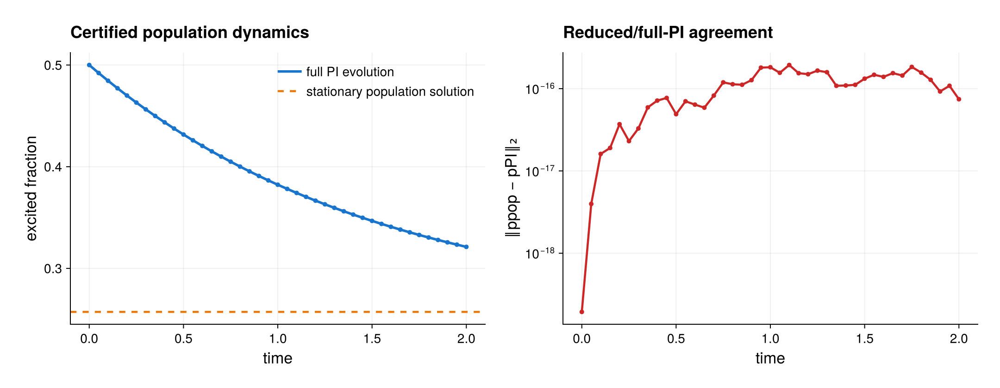

# Certified qubit population dynamics

Source: [`qubit_population_dynamics.jl`](qubit_population_dynamics.jl)

## Model

Six qubits evolve under the standard local and collective emission,
dephasing, and pumping channels constructed by `qubit_ensemble_model`. A
diagonal one-particle Hamiltonian is included as well. In the package order
``(|g>,|e>)``, the jump matrices are

```math
j_- = |g\rangle\langle e|,\qquad
j_+ = j_-^\dagger,\qquad
j_z = \frac{1}{2}\mathrm{diag}(-1,1).
```

The six keyword rates multiply the standard dissipators of these local
operators or their collective sums. In particular, the `dephasing` keyword
uses $j_z=\sigma_z/2$, so an isolated one-qubit coherence decays at half
that keyword rate.

All terms preserve states diagonal in the Schur-sector GT-pattern basis. The
initial state is the central fully symmetric Dicke state

```math
|j=N/2,m=0\rangle\langle j=N/2,m=0|.
```

## Certified reduced evolution

The example constructs and inspects one plan, avoiding duplicate compilation:

```julia
plan = PopulationPlan(model)
invariance = plan.invariance
```

`PopulationPlan` checks that no diagonal input can generate a retained
off-diagonal PI coordinate and refuses construction unless that test is
certified. Its default certificate is strict: a nonzero mixing term is not
dropped merely because its rate is small. `population_invariance(model)` is
also available when only the report is needed. The resulting population
vector contains

```math
p_{\nu,W}=\sqrt{f^\nu}(C_\nu)_{W,W},
```

so its entries are physical probabilities including the exact Schur-sector
multiplicities and sum to the state trace. For this qubit example the reduced
dimension is `sum(g_nu)`, compared with `sum(g_nu^2)` general PI coordinates.

`solve_populations` evolves only these certified variables. The script also
compiles the ordinary sparse PI Liouvillian and propagates the complete
`PIState` with the same time grid and RK4 resolution. At every saved time it
extracts `diagonal_populations` from the full solution and requires agreement
to better than `2e-10`.

## Stationary populations

`population_generator(plan; representation=:sparse)` exposes the reduced
generator $M$, and

```julia
p_stationary = stationary_populations(plan; method=:direct)
```

solves $M p_{\rm stationary}=0$ with
$\sum_i p_i=1$. The example checks the reduced residual, normalization,
reality, and nonnegativity. It reconstructs a validated `PIState` with
`state_from_populations` and compares it with a direct stationary solve in the
full PI coordinate space.

## Expected output



The left panel shows the excitation fraction from the already computed full
PI trajectory together with the reduced stationary prediction. The right
panel plots the saved-time discrepancy between certified population evolution
and the full PI evolution. Zero or extremely small values are displayed with
a small plotting floor to keep them visible on a logarithmic axis; the
asserted unmodified errors remain the regression.

## Run

```sh
julia --project=. examples/qubit_population_dynamics.jl
```

The output reports the invariance certificate, the reduced and full PI
coordinate counts, time-evolution discrepancies, and stationary residuals.
For larger systems, reuse the same `PopulationPlan`; it owns immutable reduced
geometry and avoids constructing or evolving the off-diagonal PI coordinates.
