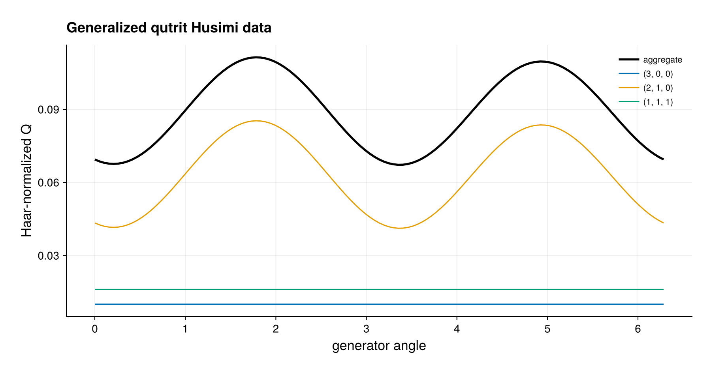

# Generalized qudit coherent-state Q data

This example evaluates the generalized coherent-state Husimi transform of a
three-qutrit PI product state. A local Hermitian generator is lifted into each
Schur irrep, so the cost is controlled by the retained Schur blocks and the
number of supplied phase-space points rather than by $3^N$.

`QuditHusimiPlan` prepares the coherent vectors once. The same plan is reused
for a nonuniform product state and the maximally mixed state. The script checks
that sector data sum to the aggregate, sector populations sum to one, and the
maximally mixed state has constant Haar-normalized density one.

The plan is tied to the exact basis and retains one coherent vector per
selected sector and supplied point. Generator input is used here because it
makes the path explicit; direct unitary input uses Float32/Float64 LAPACK Schur
factorization. The returned point sequence is a user parametrization of a
redundant `U(3)` orbit, not a canonical two-dimensional chart, and the method
does not define a qutrit Wigner quasidistribution.

A one-qubit cross-check verifies the normalization against
`spin_husimi_q`: the normalized-Haar density is $4\pi$ times the spin
sphere density. When CairoMakie is available, the figure shows the aggregate
and sector-resolved qutrit values along the generator path.

Run from the repository root with

```sh
julia --project=. examples/qudit_coherent_state_q_distribution.jl
```

or use `--project=examples` to save the optional Makie PDF and PNG.

## Expected output



The curves use the default generator orbit; the qubit normalization check is
performed numerically before rendering.
