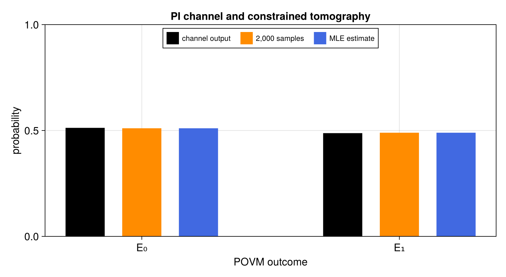

# Research utilities

[`research_utilities.jl`](research_utilities.jl) demonstrates compressed
spectral traces, population-coordinate inspection, composable PI channels,
POVM sampling, constrained PI tomography, portable checkpoints, and a joint
weak-symmetry projector. Every operation remains in retained PI coordinates.

The channel and tomography certificates apply to the retained direct-sum
Schur algebra. They do not certify permutation-breaking states or sectors
omitted from a restricted basis. The built-in `.pid` checkpoint is
dependency-free; JLD2 and HDF5 backends are optional package extensions.

Run from the repository root:

```sh
julia --project=. examples/research_utilities.jl
```

## Expected output



The channel output is compared with the fixed-seed sample frequencies and
constrained maximum-likelihood estimate. The numerical channel, checkpoint,
population, and symmetry assertions run before rendering.
