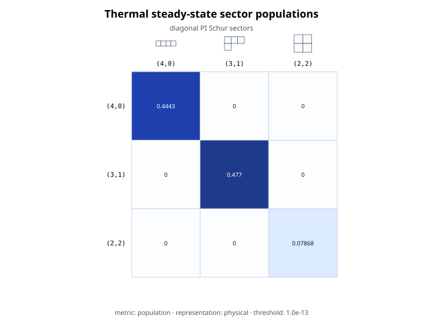
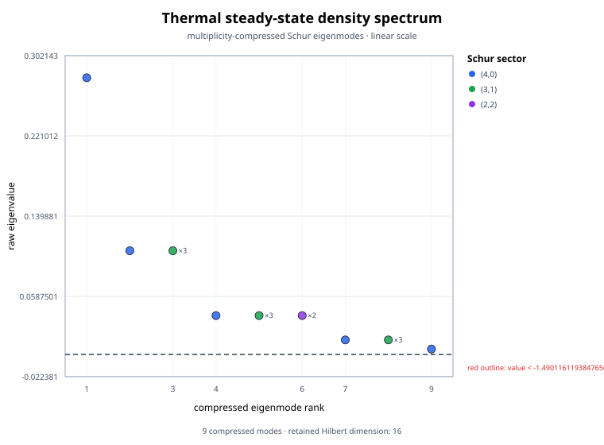
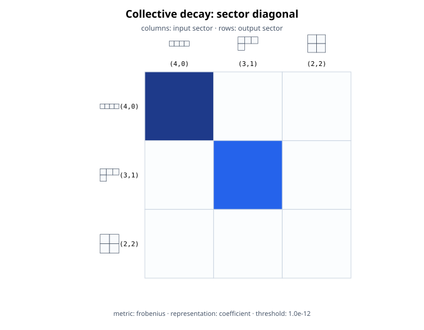
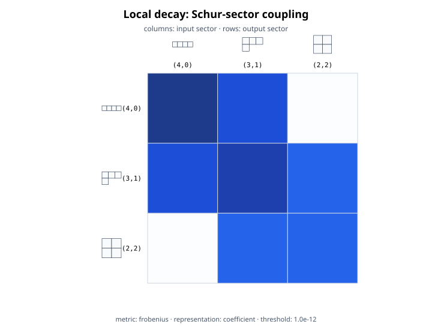

# Schur-block visualization

Source: [`schur_block_visualization.jl`](schur_block_visualization.jl)

## Purpose

This example makes the representation structure of a PI calculation visible.
It compares four objects on the complete `N = 4`, `d = 2` PI basis:

1. a solved full-rank pump--decay steady state occupying all three Schur
   sectors;
2. its multiplicity-compressed density-operator spectrum;
3. a collective-decay Liouvillian, which preserves each Schur label; and
4. an unresolved local-decay Liouvillian, which is permutation invariant but
   couples different Schur labels.

The distinction in the last two items is important. Permutation invariance
guarantees that the PI operator space is closed under the dynamics; it does
not imply that every individual Schur sector is invariant under a sum of
local dissipative channels.

## Solved steady-state blocks

For four qubits the partitions are

\[
(4,0),\qquad(3,1),\qquad(2,2).
\]

Their U(2) irrep dimensions are 5, 3, and 1, so their vectorized PI-coordinate
dimensions are 25, 9, and 1. The displayed state is computed from independent
emission and pumping,

\[
\mathcal L\rho=
\gamma_\downarrow\sum_i\mathcal D[\sigma_-^{(i)}]\rho+
\gamma_\uparrow\sum_i\mathcal D[\sigma_+^{(i)}]\rho.
\]

`stationary_state` solves the PI stationary equation. The script separately
constructs the exact iid thermal state with one-site populations
\(\gamma_\downarrow/(\gamma_\downarrow+\gamma_\uparrow)\) and
\(\gamma_\uparrow/(\gamma_\downarrow+\gamma_\uparrow)\), then checks the two
density operators agree. Every retained Schur sector has nonzero population.

```julia
state_structure = schur_block_structure(
    rho; metric=:population, threshold=1e-13)
```

The state diagram is diagonal because a PI operator has no coherences between
inequivalent Schur irreps. Here each diagonal tile is the physical trace weight

\[
p_\nu=f^\nu\mathrm{tr}(\rho_\nu),
\qquad \sum_\nu p_\nu=1,
\]

not a matrix norm. The script displays the raw populations inside the tiles
and verifies their sum. For comparison, the coefficient-block norm obeys

\[
\|C_\nu\|_F^2=f^\nu\|\rho_\nu\|_F^2,
\]

where \(\rho_\nu=C_\nu/\sqrt{f^\nu}\) is the physical block and \(f^\nu\)
is its symmetric-group multiplicity. The general
[visualization guide](../docs/src/schur_visualization.md) describes these
alternative metrics and representations.

The diagram above each diagonal tile is the Young shape of the corresponding
partition. It is not one arbitrarily chosen standard tableau: the PI block
sums over that label, and the SVG tooltip reports the exact number
\(f^\nu\) of standard tableaux together with the U(2) irrep dimension.

## Multiplicity-compressed density spectrum

The steady state is diagonalized one physical Schur block at a time:

```julia
density_spectrum = pi_density_spectrum(rho)
density_figure = visualize_density_spectrum(
    density_spectrum;
    title="Thermal steady-state density spectrum",
    show_degeneracies=true)
```

The plot's horizontal coordinate is the compressed mode rank and its vertical
coordinate is the unmodified density eigenvalue. Colour identifies the Schur
sector. Each tooltip records the partition, the within-sector eigenvalue
index, and the exact symmetric-group degeneracy. A displayed `×g` label is an
exact multiplicity, not a marker weight.

Only \(5+3+1=9\) block eigenvalues are stored and plotted, while their exact
multiplicities represent all \(2^4=16\) Hilbert-space eigenvalues. The example
checks the multiplicity-weighted trace and the retained Hilbert dimension.
It never requests `expanded=true`, so no exponentially large eigenvalue list
is constructed. Rendering reuses the precomputed spectrum and performs no
second diagonalization. See the
[spectral visualization guide](../docs/src/spectral_visualization.md) for the
density-spectrum conventions.

## Collective versus local decay

Both generators use the one-qubit lowering matrix \(\sigma_-\), but define
different Lindblad terms:

\[
\mathcal L_{\rm coll}\rho
=0.2\,\mathcal D\!\left[\sum_i\sigma_-^{(i)}\right]\rho,
\]

and

\[
\mathcal L_{\rm local}\rho
=0.2\sum_i\mathcal D\!\left[\sigma_-^{(i)}\right]\rho.
\]

The collective operator is block diagonal in the Schur label, so every active
superoperator tile lies on the diagonal. The local channel is an unresolved
sum over particles and remains PI, but its gain term transfers population and
coherences between compatible total-spin sectors. At least one off-diagonal
tile is therefore active.

For superoperators, diagram rows label the output sector and columns label the
input sector. A tile at `(row = lambda, column = nu)` measures the Frobenius
norm of the map from the vectorized coefficient block \(C_\nu\) to
\(C_\lambda\). It is a coupling-strength diagnostic, not a transition
probability or an eigenvalue. Young diagrams on the left and top axes give the
corresponding output and input partition shapes; hover tooltips retain their
exact tableau multiplicities.

## Matrix-free probing

The example deliberately compiles both models with

```julia
compile(model; backend=:matrixfree)
```

An exact Frobenius block norm can be accumulated by applying the matrix-free
map to each PI coordinate vector. Here that means only
\(25+9+1=35\) applications. No dense `35 × 35` Liouvillian is retained.
For a larger problem the same method needs one application per PI coordinate,
so block visualization is a setup diagnostic to compute once and reuse, not
an operation for every integration step. It never probes a `2^N` state or a
`4^N` full Liouville space.

`threshold=1e-12` marks blocks at or below that absolute Frobenius norm as
inactive.
The threshold changes the structural mask and drawing, not the measured
weights or the generator. The script asserts that the collective mask has no
active off-diagonal entries and that the local mask has at least one.

## Rendering and temporary files

`visualize_schur_blocks` and `visualize_density_spectrum` produce SVG without
adding a plotting package. A notebook can render either returned object with
`display`. The example uses a linear scale for the state and a logarithmic
scale for the two Liouvillians, where coupling strengths span a wider range.
`show_young_diagrams=true` is written explicitly in the script for clarity,
although it is the default; pass `false` for the compact text-only layout.

All four images are written inside `mktempdir()`:

```julia
path = joinpath(directory, "local_liouvillian.svg")
save_schur_block_visualization(path, local_figure)
```

It verifies that each file exists and contains SVG markup. The temporary
directory is deleted automatically, so running the example leaves no
generated artifact in the repository.

## Run

```sh
julia --project=. examples/schur_block_visualization.jl
```

The output reports the sector populations, compressed density eigenvalues and
exact degeneracies, sector and coordinate dimensions, and the largest
off-diagonal block norm for each Liouvillian. The collective value should be
zero up to construction roundoff; the local value should be strictly
positive.

## Expected output

Steady-state populations and compressed density spectrum:





Collective and local dissipators have visibly different inter-sector support:





These SVGs are rendered from the already computed metadata. They do not repeat
the stationary solve, diagonalization, or matrix-free probes.
