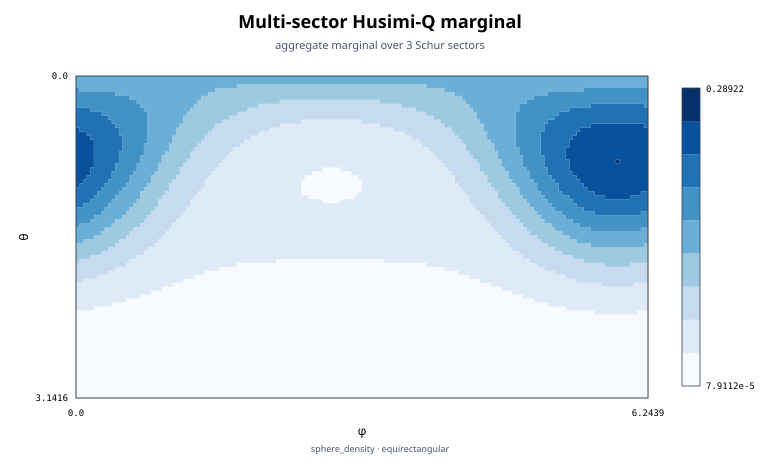
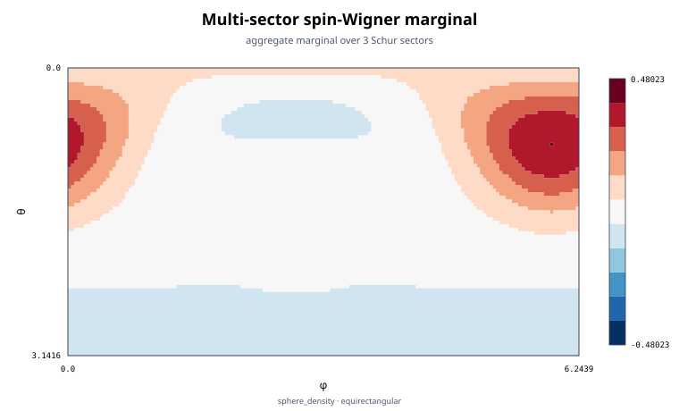
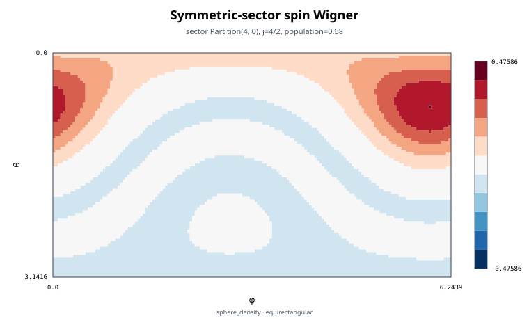

# Sector-resolved spin phase space

Source: [`spin_phase_space.jl`](spin_phase_space.jl)

## Model state

This example uses four qubits and deliberately populates two inequivalent
Schur sectors. With probability ``0.68`` the state is a coherent spin state
in the fully symmetric ``j=2`` sector. The remaining probability occupies the
``j=1,m=0`` Dicke state. For ``N=4`` the latter irrep has symmetric-group
multiplicity three, and `dicke_state` represents the uniform mixture over
those indistinguishable multiplicity copies.

The stored PI state is formed by a convex combination of coefficient vectors:

```julia
coherent = spin_coherent_state(basis, theta0, phi0)
lower_spin = dicke_state(basis, 1, 0)
rho = PIState(
    basis,
    0.68 .* coherent.data .+ 0.32 .* lower_spin.data,
)
```

No ``2^N`` vector or matrix is constructed.

## One sphere per total-spin sector

A general PI state does not belong to one spin irrep. `spin_husimi_q` and
`spin_wigner` therefore compute one angular distribution for each retained
partition and attach its exact ``j`` label, tableau multiplicity, and physical
population:

```julia
q = spin_husimi_q(rho; ntheta=81, nphi=160, resolved=true)
w = spin_wigner(rho; ntheta=81, nphi=160, resolved=true)
```

Both transforms use sphere-density normalization. Integrating a sector
matrix against ``\sin\theta\,d\theta\,d\phi`` yields that sector's population,
here ``0.68``, ``0.32``, and exactly zero for the retained ``j=0`` block.
Zero-population retained sectors remain explicit; they are not dropped by a
numerical threshold. The aggregate `values` matrix is the sum of these sector
matrices. It is the angular marginal obtained after forgetting ``j``; it is
not a claim that the mixed-sector state is one spin-2 state.

Setting `resolved=false` would reuse one grid scratch matrix and retain only
the aggregate. This example requests `resolved=true` because it also renders
the symmetric-sector Wigner function.

## Independent coherent-state check

The coherent-state overlap is maximal at its own direction. For the
fully-symmetric block, the normalized Q density there is

```math
P_Q(j=N/2,\Omega_0)=p_{N/2}\frac{N+1}{4\pi}.
```

The script evaluates this point through a sector-selected call and checks the
formula. Sector selection changes neither the block nor its normalization;
the selected result integrates to ``p_{N/2}``, not one.

## Husimi versus Wigner views

The Husimi-Q density is a coherent-state expectation and is nonnegative. The
spin-Wigner distribution is built from polarization tensors and spherical
harmonics. It retains interference information and can be negative. The
example explicitly checks that a negative sampled value survives.

```julia
q_figure = visualize_spin_phase_space(q)
w_figure = visualize_spin_phase_space(w)
symmetric_wigner_figure = visualize_spin_phase_space(
    w; sector=Partition((4, 0)))
```

The dependency-free SVG uses an equirectangular projection, with ``\phi`` on
the horizontal axis and ``\theta`` on the vertical axis. Husimi data use a
sequential palette. Wigner data use a symmetric diverging palette centered at
zero. Rendering reuses the numerical results and never repeats either
transform.

All generated SVGs are written inside a temporary directory that is removed
when the script exits. The complete conventions and performance scaling are
documented in the package's
[spin phase-space guide](../docs/src/spin_phase_space.md).

## Expected output







The Wigner snapshots retain the negative values checked by the script. Each
image reuses the resolved numerical transform and does not recompute it.
