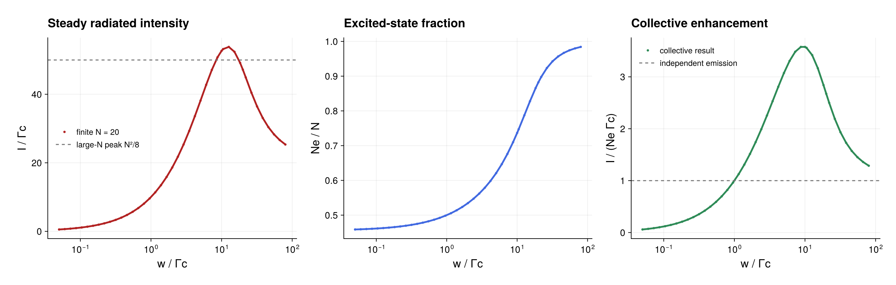

# Steady-state superradiance

Source: [`steady_superradiance.jl`](steady_superradiance.jl)

## Model

The Meiser-Thompson-Holland model combines collective emission and independent
repumping:

```math
\dot\rho=\Gamma_c\mathcal D[J_-]\rho
 +w\sum_i\mathcal D[\sigma_i^+]\rho .
```

The example uses `N = 10` and scans the pump rate from weak to strong pumping.

## Solution

Represent collective emission with `CollectiveJump` and local repumping with
`LocalJump`. For each `w`, `compile` prepares the Liouvillian once and
`stationary_state(...; algorithm=DirectAlgorithm())` solves the
trace-constrained PI linear system. The emitted intensity is

```math
I=\Gamma_c\langle J_+J_-\rangle,
```

and the excited population is contracted through a
`CollectiveObservablePlan`. The script also prints the enhancement relative
to independent emission and the large-`N` estimate `I_max ≃ N^2 Γc/8`.

## Makie figure

The optional three-panel CairoMakie figure shows the steady radiated
intensity, excited-state fraction, and collective enhancement across the pump
scan. The intensity panel includes the large-`N` peak estimate, while the
enhancement panel marks the independent-emitter value. The logarithmic pump
axis retains both the weak- and strong-pumping limits in one view. PDF and PNG
copies are saved as `steady_superradiance.*`.

## Run

```sh
julia --project=examples examples/steady_superradiance.jl
```

Finite `N` shifts and rounds the optimum, so compare trends rather than
expecting the asymptotic maximum exactly.

## Expected output



The points use the default finite ensemble; the asymptotic prediction is
included only as a reference.
