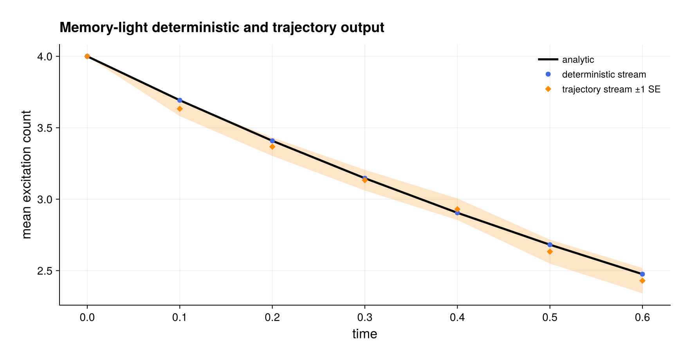

# Memory-light observable output

Source: [`streaming_output.jl`](streaming_output.jl)

This example shows how to run deterministic dynamics and trajectory ensembles
without retaining a `PIState` at every requested time. The model consists of
four initially excited, independently decaying qubits,

```math
\dot\rho=\gamma\sum_{i=1}^N\mathcal D[\sigma_-^{(i)}]\rho.
```

Its exact mean excitation count is $N e^{-\gamma t}$, so both output paths
have a direct analytical check.

## Deterministic sampling

Supplying `observables` makes `solve_dynamics` return a
`DynamicsStreamResult`. With `save_states=false`, the RK4 integrator propagates
one mutable PI state and immediately records the requested expectations:

```julia
result = solve_dynamics(
    prepared, rho0, (first(times), last(times));
    saveat=times, steps_per_interval=32,
    observables=(excitations=number,), save_states=false,
)
values = result.observables[:excitations]
@assert result.states === nothing
```

A local matrix in `observables` denotes its collective sum. A compatible
`PIOperator` may be supplied when an already prepared PI observable is
available. Deterministic expectations may be complex; they are not silently
projected to the real axis.

## Online trajectory statistics

The trajectory call uses the same `observables` and `save_states=false`
keywords:

```julia
ensemble = quantum_trajectories(
    trajectory_plan, rho0, times, 128;
    seed=2026, dt=0.005,
    threaded=Threads.nthreads() > 1, workspace=batch,
    observables=(excitations=number,), save_states=false,
)
sample = ensemble.observables.observables[:excitations]
```

Every active worker owns an observable buffer and a Welford accumulator.
Worker accumulators are merged after all paths finish. Consequently retained
observable storage scales with the number of workers, observables, and saved
times—not with the number of trajectories or the PI-coordinate dimension.
Hermitian observables are required because the returned variance and standard
error are real Monte Carlo statistics.

`ensemble.jumps` contains channel-resolved counts, rates, Fano factors,
no-jump probability, and pooled waiting-time statistics. Set
`jump_statistics=false` to omit them when only observables are needed. A
state-free call requires at least one observable; calls without observables
retain the legacy vector-of-trajectories return type.

The example checks the excitation mean using its measured standard error and
checks the final photon-count mean against its binomial law. It also reports
the PI-coordinate storage that full sampled histories would have required.

## Run

```sh
julia --project=. examples/streaming_output.jl
```

Use `save_states=true` when conditional states themselves are needed. In that
case the result still includes online observable statistics, while
`ensemble.trajectories` holds the ordinary trajectory histories.

## Expected output



The trajectory points use the documented seed and the band shows one measured
standard error. Neither plotted route retains a history of PI states.
